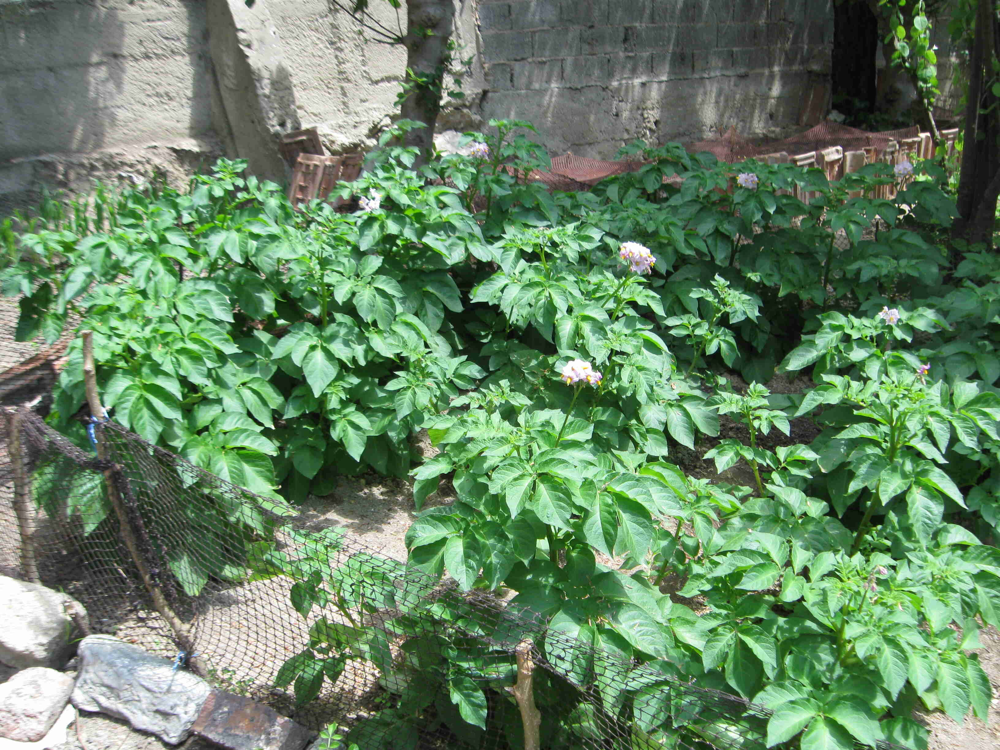
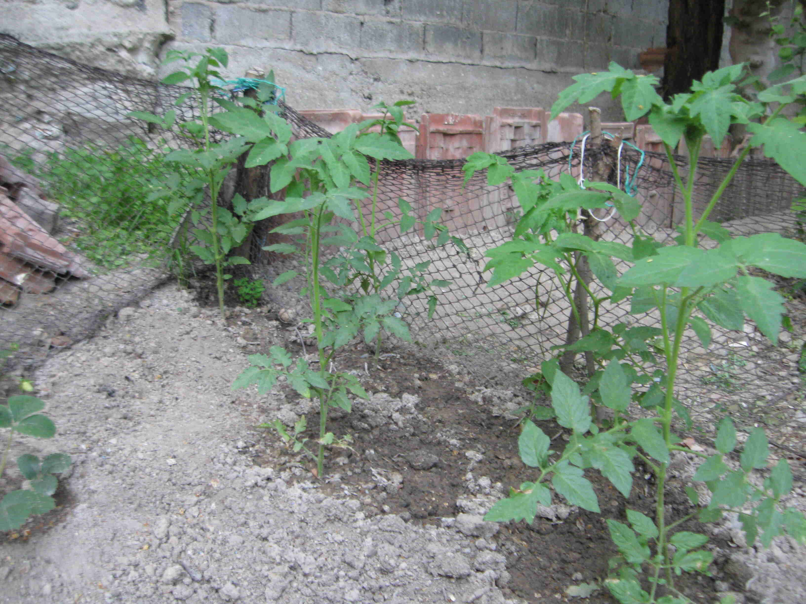
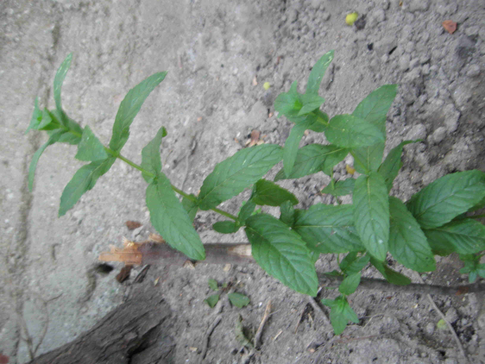

# Gardening

- Potato plants, still early and small:

- Digging the ground, clearing very deep and annoying roots. Ridiculously hard work!

- First potato flowers blossomed, how beautiful!

- Corns started to sprout.

- Potato plants grown fully:

- So many potato flowers!

- Initial strawberry planting.

- Garden overall; all of this was covered in garbage, debris, roots and ivy.

- There are dozens of stray cats everywhere, they keep digging and crapping in my garden.
  So I have to protect my plants.

- First potato harvest! Some yummy potato salad was made of these.

- A bundle of parsley that's grown.

- Early tomato plants.

- Fully grown parsley garden.

- Some fresh mint. (I also use Linux Mint!)

- Beginning cucumber plants. They need tall sticks to grow on.

- Strawberry fruits.

- Beautiful first cucumbers!

- Nice cucumber harvest, first of dozens.

- Parsley insanity!

- Tomato fruits, getting redder by the day!

- Corn on the background of my abandoned childhood home.

- Arugula, plus wild purslane which I haven't planted. It's everywhere, it just grows.

- Tons of arugula!

- A nice harvest:

- A bountiful harvest:

