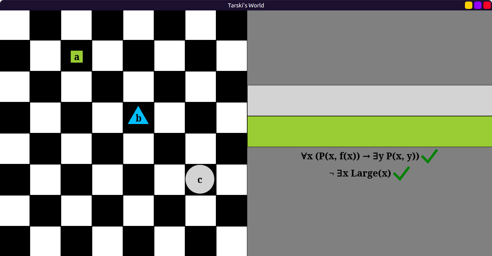

# Tarski's World

(Last updated September 2025)

Enjoy my silly design adventures and mistakes below!

- [Tarski's World](#tarskis-world)
  - [What is this?](#what-is-this)
    - [Who is Tarski?](#who-is-tarski)
    - [Approach](#approach)
  - [Parsing and interpreting First Order Logic (FOL)](#parsing-and-interpreting-first-order-logic-fol)
    - [Crude attempt at self-parsing](#crude-attempt-at-self-parsing)
      - [The issue of free variables and substitution](#the-issue-of-free-variables-and-substitution)
    - [Giving up and exploring much better options: enter GAPT](#giving-up-and-exploring-much-better-options-enter-gapt)
      - [Syntax (proofs) and semantics (world)](#syntax-proofs-and-semantics-world)
      - [Out-of-the-box parsing](#out-of-the-box-parsing)
  - [Model, View, Controller](#model-view-controller)
    - [Data: model or view? It's philosophical](#data-model-or-view-its-philosophical)
    - [Domain analysis: thinking naively and deciding the components](#domain-analysis-thinking-naively-and-deciding-the-components)
    - [Single responsibility, or "single place" for a responsibility](#single-responsibility-or-single-place-for-a-responsibility)
  - [World (model, data) design](#world-model-data-design)
    - [Grid positions](#grid-positions)
    - [Map data structures, key / value pairs, lookups](#map-data-structures-key--value-pairs-lookups)
    - [The issues with named blocks](#the-issues-with-named-blocks)
      - [Enforcing the name limitations](#enforcing-the-name-limitations)
    - [Implementing the world](#implementing-the-world)
  - [Interpreter](#interpreter)
    - [Evaluating formulas in worlds](#evaluating-formulas-in-worlds)
  - [Controller](#controller)
    - [Rendering](#rendering)
    - [Mouse input](#mouse-input)
  - [Converters](#converters)
    - [Grid positions `Pos` and coordinate positions `Point`](#grid-positions-pos-and-coordinate-positions-point)
    - [Converting from Pos to Point](#converting-from-pos-to-point)
    - [Converting from Point to Pos](#converting-from-point-to-pos)
    - [Conditional givens, extension methods](#conditional-givens-extension-methods)
    - [Converting conditionally with givens](#converting-conditionally-with-givens)
    - [Deferred givens? No, just regular old parameters](#deferred-givens-no-just-regular-old-parameters)
    - [Ad-hoc (typeclass) vs. subtype (inheritance) polymorphism](#ad-hoc-typeclass-vs-subtype-inheritance-polymorphism)
  - [Adding package boundaries to find dependency problems](#adding-package-boundaries-to-find-dependency-problems)
    - [Unavoidable coupling](#unavoidable-coupling)
      - [Dependency inversion](#dependency-inversion)
    - [Constants](#constants)
    - [Package declarations](#package-declarations)
  - [Moving from Doodle to ScalaFX, proper UI](#moving-from-doodle-to-scalafx-proper-ui)
  - [Work in progress](#work-in-progress)

## What is this?

[Recreating](https://github.com/spamegg1/tarski/) Barwise and Etchemendy's
[Tarski's World](https://www.gradegrinder.net/Products/tw-index.html)
in [Scala](https://www.scala-lang.org/)
and [Doodle](https://github.com/creativescala/doodle).

So far I have a crude approximation, but most code logic is in place:



### Who is Tarski?

[Alfred Tarski](https://en.wikipedia.org/wiki/Alfred_Tarski)
was one of the most influential logicians of the 20th century.
He is known for his work on model theory (semantics) of first order logic:
defining the concept of a model, and truth in a model.

### Approach

Many of the early decisions I made are deliberately poor choices.
For example, I started making a UI in a library that does not have any UI features.
My purpose is to learn along the way and keep breaking things.

## Parsing and interpreting First Order Logic (FOL)

In the finished program, users would be able to manually enter first order formulas like
`¬(∃x Large(x))` into text boxes, which would then be evaluated.
This meant that I had to deal with bad user input: missing / wrong parentheses,
quantifiers with missing variables, wrong use of logical connectives, and so on.

### Crude attempt at self-parsing

The original Tarski's world had some predicate symbols about the shapes, sizes and
placement of objects. Like: `FrontOf(x, y)`, `Cube(x)`, `Small(y)` etc.
It had restricted named objects to `a-f` and variables to `u-z`.

So I started making a FOL grammar:

```scala
enum Var:
  case U, V, W, X, Y, Z

enum Name:
  case A, B, C, D, E, F

type Term = Var | Name

enum Atomic:
  case Small(t: Term)
  case Medium(t: Term)
  case Large(t: Term)
  case Circle(t: Term)
  case Triangle(t: Term)
  case Square(t: Term)
  case Blue(t: Term)
  case Black(t: Term)
  case Gray(t: Term)
  case LeftOf(t1: Term, t2: Term)
  case RightOf(t1: Term, t2: Term)
  case FrontOf(t1: Term, t2: Term)
  case BackOf(t1: Term, t2: Term)
  case Adjoins(t1: Term, t2: Term)
  case Smaller(t1: Term, t2: Term)
  case Larger(t1: Term, t2: Term)
  case Same(t1: Term, t2: Term)
  case SameSize(t1: Term, t2: Term)
  case SameShape(t1: Term, t2: Term)
  case SameColor(t1: Term, t2: Term)
  case SameRow(t1: Term, t2: Term)
  case SameCol(t1: Term, t2: Term)
  case Between(t1: Term, t2: Term, t3: Term)

enum Formula:
  case Atom(a: Atomic)
  case Not(f: Formula)
  case And(f1: Formula, f2: Formula)
  case Or(f1: Formula, f2: Formula)
  case Implies(f1: Formula, f2: Formula)
  case Bicond(f1: Formula, f2: Formula)
  case Forall(v: Var, f: Formula)
  case Exists(v: Var, f: Formula)
```

#### The issue of free variables and substitution

Now this is already hard enough.
Normally, FOL has more complex terms that can use function symbols, so if `a,b,c` are
named objects and `x,y,z` are variables you could have complex terms like:
`f(x, a, g(y, z, c), b)`. This would be a nightmare for my stupid skills to deal with.
Thankfully Tarski's world has *no function symbols*, only bare atomic formulas,
quantifiers and logical connectives.

But, due to quantifiers and variables, there was still the issue of free variables.
I would have to figure out which occurrences of a variable were free,
so that when I'm evaluating a formula like `∃x(some formula)`
I would have to "peel off" the quantifier, then "plug-in" named objects for the variable:
`some formula(x = a)` only in the correct places for `x`.

I even tried to do [property testing](https://en.wikipedia.org/wiki/Property_testing) by
generating formulas with [ScalaCheck](https://github.com/typelevel/scalacheck/):

```scala
package tarski
package testing

import org.scalacheck.{Gen, Test, Prop}

val varGen = Gen.oneOf[Var](Var.values)
val nameGen = Gen.oneOf[Name](Name.values)
val termGen = Gen.oneOf[Term](varGen, nameGen)

val atomFreeGen =
  for
    vari <- varGen
    t1 <- termGen
    t2 <- termGen
  yield (vari, Seq(Medium(vari), LeftOf(vari, t1), Between(vari, t1, t2)))

val atomNonFreeGen =
  for
    vari <- varGen
    t1 <- termGen
    t2 <- termGen
    t3 <- termGen
    if vari != t1 && vari != t2 && vari != t3
  yield (vari, Seq(Medium(t1), LeftOf(t1, t2), Between(t1, t2, t3)))
```

```scala
package tarski
package testing

import org.scalacheck.Prop.forAll

class AtomicSuite extends munit.FunSuite:
  test("atomic formulas (1, 2, 3-ary) with a free variable"):
    forAll(atomFreeGen): (vari, atoms) =>
      atoms.forall(_.hasFree(vari))

  test("atomic formulas (1, 2, 3-ary) without a free variable"):
    forAll(atomFreeGen): (vari, atoms) =>
      atoms.forall(!_.hasFree(vari))
```

This is pretty tricky to do; I was always trying to get away with a surface level effort
and an "idiot's approach", but it was clear that this was going to require more theory.

### Giving up and exploring much better options: enter GAPT

I caved and started looking for out-of-the-box FOL parsers.
So grateful that [Gapt](https://github.com/gapt/gapt) existed already!
Thanks, Vienna University of Technology!

#### Syntax (proofs) and semantics (world)

This library is incredibly well put together and can handle all kinds of provers, solvers
and the like, even for higher-order logics. However, this is purely in the *syntactic*
realm of logic; concerned with symbolic proofs. Tarski's world is about *semantics*
instead: the interpretation of formulas in a concrete world with objects and values.

So I am using a *tiny* portion of Gapt's true power; only for parsing.

#### Out-of-the-box parsing

It has excellent built-in parsing support with string interpolators, for example:

```scala
val F   = fof"!x (P(x,f(x)) -> ?y P(x,y))"
val t   = fot"f(f(x))"
val G   = fof"!x (P(x,$t) -> ?y P(x,y))"
val H1  = hof"!x?y!z x(z) = y(y(z))"
val H2  = hof"∀x ∃y ∀z x(z) = y(y(z))"
```

Here `fof` is "first order formula", `fot` is "first order term" and
`hof` is "higher order formula". Notice the interpolated `$t` inside a string.
`!` and `?` are alternative syntax for `∀` "for all" and `∃` "there exists".

But it also allows full pattern matching all the way down to the atoms:

```scala
val e = fof"¬(∃x Large(x))"
e match
  case Neg(Ex(FOLVar("x"), FOLAtom("Large", List(FOLVar("x"))))) => println("yay!")
// prints yay!
```

## Model, View, Controller

This "model" is not the same as the "model" from Logic above, but conceptually similar.

The initial stage of my repository was just all over the place and disorganized.
The only "structure" I had so far was the grammar:


Then I remembered this [thing](https://en.wikipedia.org/wiki/Model–view–controller).

Of course I did no reading or research. Instead I started thinking about it naively.
To me it seemed like Controller was simply the "glue" between Model and Controller.
"Could it really be that simple? There's gotta be more to it than that", I thought.
But looks like it really is.

I reorganized the repository, at this point I still have grammar but no controller yet:


### Data: model or view? It's philosophical

The original Tarski's world software actually does have two different "views":


But I am not interested in the 3D view; not only it's very difficult to implement,
but it is also not very usable, making it hard to see objects and locations well.

So what does "view" mean for me in this case?
It's got something to do with... visuals, right? I have a `Block` class:

```scala
case class Block(
    size: Double, // Small, Medium, Large
    shape: Shape, // Tri, Squ, Cir
    color: Color, // Blue, Black, Grey
    label: String = ""
)
```

That's all visual stuff, so it should be in the View right?
But wait, isn't this *just data*? So it should be part of the Model then?
Since I don't actually have different views, I am leaning in the first direction.
So, for me, View = "visual data and related stuff".

Seems like even in the broader software world there really is no consensus.
There are many variants like model-view-presenter, model-view-adapter,
model-template-view, and even... *model-view-viewmodel*! 🤣 Yeah, sure guys.
Dana Moore says in "Professional Rich Internet Applications: Ajax and Beyond (2007)" that

> "Since the origin of MVC, there have been many interpretations of the pattern.
> The concept has been adapted and applied in very different ways
> to a wide variety of systems and architectures."

So I believe ***I do have permission to interpret things in my own way.***
I mean, all this software design / pattern / architecture stuff can get very vague.
Without pinning it down to a specific problem and seeing what comes up,
it's impossible to adhere to some predetermined pattern and its "laws".

In fact, even the names of the components are used differently.
For example, in Django, Controller is called "view" and View is called "template":
[Django FAQ](https://docs.djangoproject.com/en/5.1/faq/general/)

To quote them on this issue:

> Well, the standard names are debatable. In our interpretation of MVC, the “view”
> describes the data that gets presented to the user. It’s not necessarily how the data
> looks, but which data is presented. The view describes *which data you see*,
> not *how you see it*. It’s a subtle distinction.

I do have to admit, this stuff gets *very philosophical!*
If I say "this block is *blue*", is that "what you see" or "how you see it"?
I think I agree with them, it's which data I see, so I will go with that.

### Domain analysis: thinking naively and deciding the components

If I look at Tarski's world and think about it, allowing myself to interpret MVC freely,
I can try to decide what goes where:


I think Model is like a database. (in Django and Rails, it actually is!)
It could include:

- the chess board as a grid, with blocks (actual data) placed on it
  - receive commands from Controller to add / remove / move blocks in the database
- the current state: which names are occupied by objects, etc.
  - receive commands from Controller to change this state

View could include:

- all the graphically relevant constants (board size, number of rows and columns etc.)
- the description of blocks (but not the actual data)
  - things like shape, color, size, etc.
- the description of formula displays
- the description of the UI, buttons, etc.
- For each description, also the mechanism to convert data to an image

Controller could include functionality like:

- receive a mouse click to add / remove / move a block
  - tell Model to update
  - these have to ***convert*** the cursor position to grid position
- receive a mouse click to add / remove a name to / from an object (tell Model to update)
- receive a mouse click to evaluate formulas
  - call Interpreter with data from Model
  - then use View's mechanism to convert them to images to display them

This naive approach is probably violating some rules about the separation of Model, View
and Controller and how they are supposed to interact, but oh well. Let's go!

### Single responsibility, or "single place" for a responsibility

With this design the job of displaying objects is somewhat split into two,
and distributed between View and Controller:

- the View converts a single block to a single image,
- the Controller gets all the individual images and puts them together.

Now there is a well known principle called the "Single Responsibility Principle"
which is part of the SOLID principles. I was thinking that there might be a similar
principle, like "the code and logic for a single functionality or
responsibility should all be in a single place, not spread out all over the place."
Not sure if there is one, or what it might be called? Anyway, I am violating it! 😆

It does make sense for View to convert a `Block` to an `Image` since how a block looks
is independent of everything else, looks the same no matter where it is.

But maybe the "rendering all the blocks" logic could be moved into View too?
Then View would have to talk to Model directly instead of through the Controller...
Or View would ask Controller for the blocks, Controller would ask Model,
get them from Model, then hand it over to View...
ah well, at this point it's all semantics, who cares 🤷 I'll come up with something.

## World (model, data) design

### Grid positions

Very basic 2D grid stuff. I need to implement Tarski's world atomic formulas such as
`FrontOf`, `BackOf`, `LeftOf`, `RightOf` etc.

Here we are using Scala's new feature [named tuples](https://www.scala-lang.org/api/current/docs/other-new-features/named-tuples.html):

```scala
type Pos = (row: Int, col: Int)

extension (p: Pos)
  def neighbors = Seq(
    (p.row - 1, p.col),
    (p.row + 1, p.col),
    (p.row, p.col - 1),
    (p.row, p.col + 1)
  )

  def leftOf(q: Pos)  = p.col < q.col
  def rightOf(q: Pos) = p.col > q.col
  def frontOf(q: Pos) = p.row > q.row
  def backOf(q: Pos)  = p.row < q.row
  def sameRow(q: Pos) = p.row == q.row
  def sameCol(q: Pos) = p.col == q.col
  def adjoins(q: Pos) = p.neighbors.contains(q)
```

But Tarski's world has a predicate named `Between` which is quite complicated!
Three blocks could be on the same row, the same column, or the same diagonal.
Moreover they can be in various orders. It's quite annoying to check!

```scala
extension (p: Pos)
  // ...
  def sameRow2(q: Pos, r: Pos) = p.sameRow(q) && p.sameRow(r)
  def sameCol2(q: Pos, r: Pos) = p.sameCol(q) && p.sameCol(r)
  def rowBtw(q: Pos, r: Pos)   = q.backOf(p) && p.backOf(r)
  def colBtw(q: Pos, r: Pos)   = q.leftOf(p) && p.leftOf(r)
  def rowBtw2(q: Pos, r: Pos)  = p.rowBtw(q, r) || p.rowBtw(r, q)
  def colBtw2(q: Pos, r: Pos)  = p.colBtw(q, r) || p.colBtw(r, q)
  def botDiag(q: Pos, r: Pos)  = p.colBtw(q, r) && p.rowBtw(r, q)
  def topDiag(q: Pos, r: Pos)  = p.colBtw(q, r) && p.rowBtw(q, r)
  def botDiag2(q: Pos, r: Pos) = p.botDiag(q, r) || p.botDiag(r, q)
  def topDiag2(q: Pos, r: Pos) = p.topDiag(q, r) || p.topDiag(r, q)
  def diagBtw(q: Pos, r: Pos)  = p.botDiag2(q, r) || p.topDiag2(q, r)
  def between(q: Pos, r: Pos) =
    p.sameRow2(q, r) && p.colBtw2(q, r) ||
      p.sameCol2(q, r) && p.rowBtw2(q, r) ||
      p.diagBtw(q, r)
```

### Map data structures, key / value pairs, lookups

Considering the interactions above, I would need a way to:

- look up a block by grid position (to add/remove blocks on the board)
- look up a block by label (to evaluate formulas that use its label)

This is an annoying situation, because I need a "multi-key map"
where the same value has multiple, differently typed keys.
I did some searching online. There are multi-value maps,
multi-key maps of the same type, but not quite what I need.

I guess what I *really* need here is a relational database... but screw that!
So I ended up with a compromise of having TWO maps.
The downside is that BOTH maps have to be updated every time something changes.
I will use a proper relational database later, I promise!

Once again, named tuples:

```scala
type Grid   = Map[Pos, (block: Block, name: Name)]
type Blocks = Map[Name, (block: Block, pos: Pos)]
```

### The issues with named blocks

Names are optional in Tarski's world. This is fine for most formulas.
If a formula uses names, like `Smaller(a, b)`, we can look up the blocks with those names.

But this creates a problem when evaluating quantifiers. For example, for a universal
quantifier ("for all") I need to evaluate *every block*, including the unnamed blocks.
Similarly for an existential quantifier ("there exists"), I might have to check every
block to see if at least one of them satisfies the formula.

The Gapt library requires a name for an object constant: `FOLConst("???")`,
but I cannot just use the empty string `""` since there can be multiple unnamed blocks.

Initially I made the name into an `Option[String]` type,
and tried to do some special casing logic. Did not work too well.

Second, I tried to have a parallel "block ID number" system that is separate from names.
So, whether named or unnamed, each block would have a unique ID number.
This could be made to work, with a lot of work. But it got hard and complicated.
When I needed to look up a named block, I would have to first look up its ID number.
So I needed a THIRD map, between names and ID numbers; moreover there had to be special
casing code to check if I was working with a "named ID number" or an "unnamed ID number".
Ugh... 🤮

So... I decided to generate fake names for the unnamed blocks.
That way they can be looked up and used easily without hard-coding some special casing:

```scala
type Name = String

object Name:
  var counter = -1
  def generateFake: Name =
    counter += 1
    s"block$counter"
```

Now blocks have names like `"a", "b", "c", "d", "e", "f"` and `"block0", "block1", ...`

#### Enforcing the name limitations

Since the only available names are `a, b, c, d, e, f` I need to keep track of
the names that are assigned to blocks and names that are unused.
Each `World` instance will start with a map of `a,b,c,d,e,f` names all available:

```scala
enum Status:
  case Available, Occupied

object World:
  // only 6 names are allowed: a,b,c,d,e,f
  val initNames = Map(
    "a" -> Available,
    "b" -> Available,
    "c" -> Available,
    "d" -> Available,
    "e" -> Available,
    "f" -> Available
  )
```

Thanks to the following code, fake names like `"block0"` cannot be occupied:

```scala
type Names = Map[Name, Status] // a,b,c,d,e,f

extension (names: Names) // these work whether the name is fake or not.
  def avail(name: Name): Names = names.get(name) match
    case Some(Occupied)  => names.updated(name, Available)
    case Some(Available) => names
    case None            => names // name was fake

  def occupy(name: Name): Names = names.get(name) match
    case Some(Available) => names.updated(name, Occupied)
    case Some(Occupied)  => names
    case None            => names // name was fake
```

### Implementing the world

Very boring CRUD-like operations:

- create/update/delete a block from the grid,
- add/remove names from blocks.

Here is just one example, a rather complicated one.
The scenario is to click on an unnamed block on the grid, and add a name to it.
Grid, blocks (by name) and available / occupied names all have to be updated.
You can see the extra code caused by my double, no wait, now it's triple, `Map` design:

```scala
// this is tricky; since fake names are also involved.
def addNameToBlockAt(pos: Pos)(name: Name): World = grid.get(pos) match
  case None => this
  case Some((block, oldName)) => // make sure there is a block at position
    names.get(oldName) match
      case Some(_) => this
      case None => // make sure the block does not already have a real name
        names.get(name) match
          case None           => this
          case Some(Occupied) => this
          case Some(Available) => // make sure the name is available
            val newBlock  = block.setLabel(name)
            val newGrid   = grid.updated(pos, (newBlock, name))
            val newBlocks = blocks.removed(oldName).updated(name, (newBlock, pos))
            val newNames  = names.occupy(name)
            copy(grid = newGrid, blocks = newBlocks, names = newNames)
```

## Interpreter

Here we are not concerned with recursion depth, stack overflow, or performance.
The evaluated formulas will be dead simple, and the worlds will be very small.

### Evaluating formulas in worlds

We only need the blocks from a world. The logical connective part is very easy:

```scala
def eval(formula: FOLFormula)(using blocks: Blocks): Boolean = formula match
  case a: FOLAtom => evalAtom(a)
  case And(a, b)  => eval(a) && eval(b)
  case Or(a, b)   => eval(a) || eval(b)
  case Neg(a)     => !eval(a)
  case Imp(a, b)  => if eval(a) then eval(b) else true
  case Iff(a: FOLFormula, b: FOLFormula) =>
    val (ea, eb) = (eval(a), eval(b))
    ea && eb || !ea && !eb
  case All(x, f) => blocks.keys.forall(name => eval(f.substitute(x, FOLConst(name))))
  case Ex(x, f)  => blocks.keys.exists(name => eval(f.substitute(x, FOLConst(name))))
```

The most interesting parts are the quantifiers. Here, the variable substitution problem
I mentioned earlier is neatly solved by the Gapt library.

The atomic formula part is more tedious. It's much longer, here are just a few cases:

```scala
private def evalAtom(a: FOLAtom)(using b: Blocks): Boolean = a match
  case FOLAtom("Small", Seq(FOLConst(c)))                => b(c).block.size == Small
  case FOLAtom("Triangle", Seq(FOLConst(c)))             => b(c).block.shape == Tri
  case FOLAtom("Green", Seq(FOLConst(c)))                => b(c).block.color == Green
  case FOLAtom("LeftOf", Seq(FOLConst(c), FOLConst(d)))  => b(c).pos.leftOf(b(d).pos)
  case FOLAtom("Smaller", Seq(FOLConst(c), FOLConst(d))) => b(c).block.smaller(b(d).block)
  case FOLAtom("Larger", Seq(FOLConst(c), FOLConst(d)))  => b(c).block.larger(b(d).block)
  case FOLAtom("=", Seq(FOLConst(c), FOLConst(d)))       => b(c).block == b(d).block
  case FOLAtom("SameRow", Seq(FOLConst(c), FOLConst(d))) => b(c).pos.sameRow(b(d).pos)
  // ...
```

## Controller

Controller has the logic for:

- rendering
- handling input
- converting

### Rendering

TODO

### Mouse input

Using a library that does not support UI elements (like buttons) made me come up with
a really weird solution. I divided the UI into regions, each with its own "origin",
and the click coordinates `x,y` would be converted to grid positions *relatively*
with respect to that origin:


There is the origin of the entire UI, the origin of the chess board,
and the origin of the top-right controls.
In each case, the "button" click is checked by calculating from each respective origin.
Horrible idea and design... but it will work for now,
until I switch to a proper GUI library later.

TODO

## Converters

Given the model I decided on, I have to convert between grid positions (`Int`)
and arbitrary points on the plane (`Double`). This is a fairly common problem.
So there must be many well-made solutions out there. But of course, screw that!
I gotta do it from scratch.

### Grid positions `Pos` and coordinate positions `Point`

The `Point` system of Doodle work as a Cartesian system centered at the origin.
The `Grid` system starts at the top-left, and grows to the right and bottom.
`Point` uses `Double` while `Grid` is integer only.


In this system, the left side has `x` coordinate equal to `-width / 2`, and
the top side has `y` coordinate equal to `height / 2`.

### Converting from Pos to Point

This is the easier part.
The board has a width, a height, and numbers of rows and columns.
The height and width of an invidivial block can be calculated from those.
Then, a grid position will be the point that is at the center of the square it represents.
The `0.5` comes from this center (half of the square).

```scala
// blockWidth  is boardWidth  / numOfColumns
// blockHeight is boardHeight / numOfRows
// left is -width / 2, top is height / 2
extension (pos: Pos)
  def toPoint: Point =
    val x = left + (0.5 + pos.col) * blockWidth
    val y = top - (0.5 + pos.row) * blockHeight
    Point(x, y)
```

### Converting from Point to Pos

This is harder since a `Point` is arbitrary and I cannot expect the user to click exactly
on the center of a square on the grid. So, anywhere on a square should count as the same.


Fortunately, the `Double` to `Int` conversion will help with that! I can use the inverse
of the same formula from above, and the `.toInt` conversion acts like a floor function.
This way, all the `x, y` coordinates will round down to the same grid `row` and `col`:

```scala
extension (point: Point)
  def toPos: Pos =
    val row = (top - point.y) / blockHeight  // -0.5 has to be excluded
    val col = (-left + point.x) / blockWidth // -0.5 has to be excluded
    (row.toInt, col.toInt)
```

### Conditional givens, extension methods

It made sense to turn this conversion stuff into a trait.
Initially I decided to do it as an implicit typeclass instance, which provides
extension methods to `Point` and `Pos` which uses *itself* as an implicit parameter:

```scala
trait Converter:
  val blockHeight: Double
  val blockWidth: Double
  val top: Double
  val left: Double
  extension (pos: Pos) def toPoint(using Converter): Point
  extension (point: Point) def toPos(using Converter): Pos
```

This way, an implicit `Converter` instance would be provided at the beginning,
and all the `.toPoint` and `.toPos` methods would pick it up automatically,
without any annoying parameter passing down all over the place.
This is a very nice, elegant design.

However, the conversions depend on the board width, height, and the grid's number of rows
and columns, and these would have to be passed down everywhere too.
So... we can make them implicit too! Then we can use Scala's *conditional givens*.
A conditional given consumes other givens as implicit parameters and produces a new given.

```scala
given (dims: Dimensions) => (gs: GridSize) => Converter:
```

From the board dimensions (width and height), and grid size (numbers of rows and columns),
we can derive the height and width of a block, and the top / left of the board:

```scala
given (dims: Dimensions) => (gs: GridSize) => Converter:
  val blockHeight: Double = dims.h / gs.rows
  val blockWidth: Double = dims.w / gs.cols
  val top: Double = dims.h / 2
  val left: Double = dims.w / 2
  // followed by the conversion extension methods from above
```

### Converting conditionally with givens

This design was so beautiful and clever, it made me feel very smart!
However, using it caused some friction, and made me notice an anti-pattern:
trying to conditionally choose a given, among many givens of the same type, is painful!
I have to use 3 different dimensions/grid sizes, and corresponding conversions:

```scala
object UIConverter:
  given Dimensions = (h = Height, w = Width)
  given GridSize = (rows = BoardRows, cols = BoardCols * 2)

object BoardConverter:
  given Dimensions = (h = Height, w = Width / 2)
  given GridSize = (rows = BoardRows, cols = BoardCols)

object ControlsConverter:
  given Dimensions = (h = Height / 8, w = Width / 2)
  given GridSize = (rows = ControlRows, cols = ControlCols)

def convertPointConditionally(p: Point): Pos =
  if p.x < 0 then
    import BoardConverter.given
    Point(p.x - BoardOrigin.x, p.y - BoardOrigin.y).toPos
  else if p.y > ControlsBottom then
    import ControlsConverter.given
    Point(p.x - ControlsOrigin.x, p.y - ControlsOrigin.y).toPos
  else
    import UIConverter.given
    p.toPos
```

As you see, in order to avoid "ambiguous given instances" errors, I have to place
each given in a separate object to put them in different scopes,
then I have to manually import that particular object's givens.
Another problem is that this obscures the intent of the code for the reader.

The anti-pattern is: "don't use givens if, a given does not apply generally
and has to be selected conditionally among many givens of the same type."
Or more generally: "don't make a given-based design if it's getting too complicated."

### Deferred givens? No, just regular old parameters

There *is* a way to improve this a bit, using another advanced Scala feature:
[deferred givens](https://docs.scala-lang.org/scala3/reference/contextual/deferred-givens.html)

Instead of a conditional given, I could "lift" the `Dimensions` and `GridSize` givens
up into the `Converter` trait itself as abstract / unimplemented members:

```scala
trait Converter:
  given dims: Dimensions
  given gs: GridSize
  // ... the rest of the trait
```

But abstract givens are being phased out / replaced by deferred givens
(as mentioned in the documentation above):

```scala
trait Converter:
  given Dimensions as dims = deferred
  given GridSize as gs = deferred
  // ... the rest of the trait
```

Then these have to be implemented by concrete instances:

```scala
object BoardConverter extends Converter:
  given Dimensions = (h = Height, w = Width / 2)
  given GridSize = (rows = BoardRows, cols = BoardCols)
```

Then it dawned on me... all this given mechanism is just redundant!
Traits in Scala can *accept parameters!* 🤣 I totally forgot about that!
If I give up on making everything implicit, and make them explicit instead, then:

```scala
trait Converter(dims: Dimensions, gs: GridSize)
```

Now the extension methods do not work because the trait is not a given instance;
we have to use the conversion methods directly:

```scala
trait Converter(dims: Dimensions, gs: GridSize):
  val blockHeight: Double = dims.h / gs.rows
  val blockWidth: Double  = dims.w / gs.cols
  val top: Double         = dims.h / 2
  val left: Double        = -dims.w / 2
  def toPoint(pos: Pos): Point =
    val x = left + (0.5 + pos.col) * blockWidth
    val y = top - (0.5 + pos.row) * blockHeight
    Point(x, y)
  def toPos(point: Point): Pos =
    val row = (top - point.y) / blockHeight  // - 0.5
    val col = (-left + point.x) / blockWidth // - 0.5
    (row.toInt, col.toInt)
```

### Ad-hoc (typeclass) vs. subtype (inheritance) polymorphism

Sometimes ad-hoc polymorphism is not a good fit for a solution,
and instead a traditional, OOP subtyping is a much better fit.
Generally we are told to prefer composition over inheritance,
but this is one of those rare cases where inheritance is better.

I can define the parameters for each instance purely as constants, not givens:

```scala
val UIDimensions       = (h = Height, w = Width)
val UIGridSize         = (rows = BoardRows, cols = BoardCols * 2)
val BoardDimensions    = (h = Height, w = Width / 2)
val BoardGridSize      = (rows = BoardRows, cols = BoardCols)
val ControlsDimensions = (h = Height / 8, w = Width / 2)
val ControlsGridSize   = (rows = ControlRows, cols = ControlCols)
```

then we just extend the trait!

```scala
object UIConverter       extends Converter(UIDimensions, UIGridSize)
object BoardConverter    extends Converter(BoardDimensions, BoardGridSize)
object ControlsConverter extends Converter(ControlsDimensions, ControlsGridSize)
```

Now the conditional conversion logic is much simpler and the intent is clearer:

```scala
def convertPointConditionally(p: Point): Pos =
  if p.x < 0 then BoardConverter.toPos((p - BoardOrigin).toPoint)
  else if p.y > ControlsBottom then ControlsConverter.toPos((p - ControlsOrigin).toPoint)
  else UIConverter.toPos(p)
```

## Adding package boundaries to find dependency problems

So far everything is inside one big `package tarski`. Now I add packages for `controller`,
`view` and `model` to see how dependencies work and what needs to be imported.
This will also expose how the components are coupled and communicate with each other.
But I'd like to avoid having too many `import`s everywhere.

Adding `package view` to the View exposed some compilation errors,
but they were solved by a fairly small amount of `import`s.

Controller will no doubt have to import stuff both from View and Model,
since it is the intersection of the two.
Model has to import from View as well, since it holds the types of data defined in View.
This is normal and not unnecessary coupling.
I think it makes sense for Controller to import from View and Model,
and for Model to import the data types from View,
but View should not import from the others.

### Unavoidable coupling

One issue I found was with `FormulaBox`: its `.toImage` method depends on Interpreter,
because it needs to evaluate the formula, then produce a T/F image.
Evaluating the formula requires `World` from Model, and Interpreter from `Controller`.
This logic should be moved to Controller, probably.

But... the problem goes a bit deeper: `FormulaBox` has a `CheckBox` field which determines
its true/false state; so the T/F image is coupled. Should it be separated and moved?
This data is kept in `Model` and it has to be updated when formulas are evaluated.
Where should this functionality go? Model's update functionality is kept in itself.

The solution is a compromise: `FormulaBox` should keep its update method,
which is purely data-related; but instead of manually evaluating the formula,
it should accept the `Boolean` result of the evaluation.
Then the renderer in Controller will do the evaluation.

#### Dependency inversion

If I wanted to stick to SOLID design principles strictly, I should probably make some
kind of interface that View and Controller both depend on and use.
Because, changes to one will trigger changes to the other. This is called
[Dependency Inversion](https://en.wikipedia.org/wiki/Dependency_inversion_principle).
But I will cross that bridge when I come to it.

### Constants

Another issue was with the constants. They feel like they belong in View, but maybe
they also belong in a broader, "main" section? Not sure.
I put them inside an `object Constants` so it's clear where they are coming from.
Then inside `package view`, I `export Constants.*` so it's available package-wide.

Tests also need all the constants. Adding `package testing` did not break anything.
Testing imports from all the others, which is OK.

### Package declarations

Maybe it's a good idea to have a `package.scala` for each package,
and export all the necessary imports, inside that package,
to avoid repeating all the imports? So far the imports are very few, so it's unnecessary.
No, I will go with this idea. It's nice to eliminate annoying imports.

Initially I added a `package.scala` with `export`s in each folder (`model`, `view`,
`controller` and `testing`). Then I decided to place them all in one "main" file.
Here I am using package declarations in a way *literally no one else* does in Scala.
Notice the actual `:` and indentation following the package declarations:

```scala
package tarski:
  // project-wide imports of third-party libraries, as exports. For example:
  export cats.effect.unsafe.implicits.global
  export doodle.core.{Color, Point, OpenPath}
  export gapt.expr.stringInterpolationForExpressions
  extension (f: FOLFormula)
    def substitute(x: FOLVar, c: FOLConst) = FOLSubstitution((x, c)).apply(f)
  // ... more of that...

  // project-internal imports from one package to another, as exports
  package model:
    export view.{Block, FormulaBox, Controls}

  package view:
    export Constants.*

  package controller:
    export model.{Pos, Blocks, Grid, GridSize, World}, Pos.*
    export view.{Controls, FormulaBox, Constants}, Constants.*
    export Converter.*

  package testing:
    export model.{World, Grid, Blocks, Status}, Status.*
    export view.{Block, Constants}, Constants.*
    export controller.{eval, Converter}, Converter.*
```

This is a very elegant solution for me, which I think would be unacceptable in industry.
There are no `import`s anywhere anymore, and everything is in one place.
It's nice since it is a small personal project.
In a large project with multiple people working on it, this would be a no-no,
since `import`s at the top of a file tell programmers where things come from.

One limitation I found is that `export`s don't work with packages and with Java stuff.
If we try to export a package Scala actually gives us an error:
"Implementation restriction". So it makes logical sense, but is restricted for reasons.
There are ways around it, like wrapping things with `object`s and then exporting that.
But that defeats the purpose, so I'll live with one or two `import`s.

## Moving from Doodle to ScalaFX, proper UI

## Work in progress

Stay tuned!
