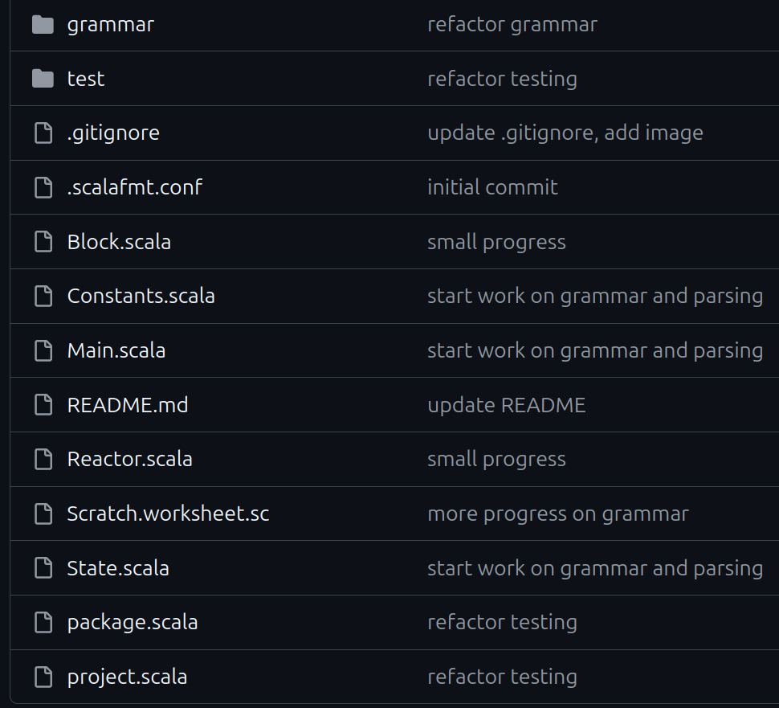

# Tarski's World



(Last updated Jan 12, 2026)

Enjoy my silly design adventures and mistakes below!

- [Tarski's World](#tarskis-world)
  - [What is this?](#what-is-this)
    - [Who is Tarski?](#who-is-tarski)
    - [Approach](#approach)
  - [Parsing and interpreting First Order Logic (FOL)](#parsing-and-interpreting-first-order-logic-fol)
    - [Crude attempt at self-parsing](#crude-attempt-at-self-parsing)
      - [The issue of free variables and substitution](#the-issue-of-free-variables-and-substitution)
    - [Giving up and exploring much better options: enter GAPT](#giving-up-and-exploring-much-better-options-enter-gapt)
      - [Syntax (proofs) and semantics (world)](#syntax-proofs-and-semantics-world)
      - [Out-of-the-box parsing](#out-of-the-box-parsing)
  - [Model, View, Controller](#model-view-controller)
    - [Data: model or view? It's philosophical](#data-model-or-view-its-philosophical)
      - [No consensus out there](#no-consensus-out-there)
    - [Domain analysis: thinking naively and deciding the components](#domain-analysis-thinking-naively-and-deciding-the-components)
      - [Dependency inversion](#dependency-inversion)
  - [World (model, data) design](#world-model-data-design)
    - [Grid positions](#grid-positions)
    - [Map data structures, key / value pairs, lookups](#map-data-structures-key--value-pairs-lookups)
    - [The issues with named blocks](#the-issues-with-named-blocks)
      - [Enforcing the name limitations](#enforcing-the-name-limitations)
    - [Implementing the world](#implementing-the-world)
  - [Interpreter](#interpreter)
    - [Evaluating formulas in worlds](#evaluating-formulas-in-worlds)
    - [The problem with names missing from the world](#the-problem-with-names-missing-from-the-world)
  - [Controller](#controller)
    - [Reactor: a guide](#reactor-a-guide)
    - [Mouse input](#mouse-input)
    - [Converters](#converters)
      - [Grid positions `Pos` and coordinate positions `Point`](#grid-positions-pos-and-coordinate-positions-point)
      - [Converting from Pos to Point](#converting-from-pos-to-point)
      - [Converting from Point to Pos](#converting-from-point-to-pos)
      - [Conditional givens, extension methods](#conditional-givens-extension-methods)
      - [Converting conditionally with givens: an anti-pattern](#converting-conditionally-with-givens-an-anti-pattern)
      - [Deferred givens? No, just regular old parameters](#deferred-givens-no-just-regular-old-parameters)
      - [Ad-hoc (typeclass) vs. subtype (inheritance) polymorphism](#ad-hoc-typeclass-vs-subtype-inheritance-polymorphism)
    - [Handlers](#handlers)
      - [Handling board positions](#handling-board-positions)
      - [Handling controls](#handling-controls)
      - [Wrapping and forwarding](#wrapping-and-forwarding)
  - [View](#view)
    - [Imaging](#imaging)
      - [Basic syntax coloring](#basic-syntax-coloring)
    - [Rendering](#rendering)
    - [Main renderer](#main-renderer)
    - [View or Model? (again): state of the controls](#view-or-model-again-state-of-the-controls)
      - [Initial approach: keep it in Model](#initial-approach-keep-it-in-model)
      - [Second attempt: the `Controls` class](#second-attempt-the-controls-class)
      - [Problems that arise by moving it from Model to View](#problems-that-arise-by-moving-it-from-model-to-view)
      - [Should `Controls` state be in... the Controller?](#should-controls-state-be-in-the-controller)
    - [Rotating the board](#rotating-the-board)
      - [Rotator class (has to go into Controller)](#rotator-class-has-to-go-into-controller)
  - [Adding package boundaries to find dependency problems](#adding-package-boundaries-to-find-dependency-problems)
    - [Dependency tree](#dependency-tree)
    - [Package declarations](#package-declarations)
  - [Moving from Doodle to ScalaFX, proper UI](#moving-from-doodle-to-scalafx-proper-ui)
  - [Exposing the library to users](#exposing-the-library-to-users)
    - [Issue with smaller screen sizes](#issue-with-smaller-screen-sizes)
      - [First approach: make `Size` a `given`, then use conditional givens](#first-approach-make-size-a-given-then-use-conditional-givens)
      - [Second approach: change `Size` to use an implicit `ScaleFactor`](#second-approach-change-size-to-use-an-implicit-scalefactor)
      - [Understanding the problem a bit better](#understanding-the-problem-a-bit-better)
      - [A "singleton object with an implicit parameter"?](#a-singleton-object-with-an-implicit-parameter)
      - [Third approach: create a `Constants` class](#third-approach-create-a-constants-class)
      - [A trick: singleton object plus extension methods](#a-trick-singleton-object-plus-extension-methods)
      - [Too many extension methods](#too-many-extension-methods)
      - [Final approach: use a combination of approaches](#final-approach-use-a-combination-of-approaches)
      - [Silly fun with different rows and columns](#silly-fun-with-different-rows-and-columns)
    - [Import / export issues](#import--export-issues)
    - [Font issues](#font-issues)
      - [Bundling the font](#bundling-the-font)
  - [Finally releasing the damn thing into the wild](#finally-releasing-the-damn-thing-into-the-wild)
    - [Adding library ScalaDoc comments](#adding-library-scaladoc-comments)
    - [Generating documentation to be uploaded to javadoc.io](#generating-documentation-to-be-uploaded-to-javadocio)
    - [Project name and versioning](#project-name-and-versioning)
    - [Github releases](#github-releases)
    - [Local publishing](#local-publishing)
    - [Releasing artifacts to Maven with Scala-cli](#releasing-artifacts-to-maven-with-scala-cli)
    - [Automating releases with Github Actions](#automating-releases-with-github-actions)
  - [Companion repository](#companion-repository)
    - [Dogfooding is great](#dogfooding-is-great)
  - [The game](#the-game)
    - [Reorganization](#reorganization)
    - [Game model](#game-model)
    - [Game controller: handler](#game-controller-handler)
    - [Game view: renderer](#game-view-renderer)
      - [Factoring out Board rendering](#factoring-out-board-rendering)
  - [What's next](#whats-next)
  - [Work in progress](#work-in-progress)

## What is this?

[Recreating](https://github.com/spamegg1/tarski/) Barwise and Etchemendy's
[Tarski's World](https://www.gradegrinder.net/Products/tw-index.html)
in [Scala](https://www.scala-lang.org/)
and [Doodle](https://github.com/creativescala/doodle).
(I might switch to ScalaFX later.)

So far I have a crude approximation, but most code logic is in place:


### Who is Tarski?

[Alfred Tarski](https://en.wikipedia.org/wiki/Alfred_Tarski)
was one of the most influential logicians of the 20th century.
He is known for his work on model theory (semantics) of first order logic:
defining the concept of a model, and truth in a model.

### Approach

Many of the early decisions I made are deliberately poor choices.
For example, I started making a UI in a library that does not have any UI features.
My purpose is to learn along the way and keep breaking things.

## Parsing and interpreting First Order Logic (FOL)

In the finished program, users would be able to manually enter first order formulas like
`¬(∃x Large(x))` into text boxes, which would then be evaluated.
This meant that I had to deal with bad user input: missing / wrong parentheses,
quantifiers with missing variables, wrong use of logical connectives, and so on.

### Crude attempt at self-parsing

The original Tarski's world had some predicate symbols about the shapes, sizes and
placement of objects. Like: `FrontOf(x, y)`, `Cube(x)`, `Small(y)` etc.
It had restricted named objects to `a-f` and variables to `u-z`.

So I started making a FOL grammar:

```scala
enum Var:
  case U, V, W, X, Y, Z

enum Name:
  case A, B, C, D, E, F

type Term = Var | Name

enum Atomic:
  case Small(t: Term)
  case Medium(t: Term)
  case Large(t: Term)
  case Circle(t: Term)
  case Triangle(t: Term)
  case Square(t: Term)
  case Blue(t: Term)
  case Black(t: Term)
  case Gray(t: Term)
  case LeftOf(t1: Term, t2: Term)
  case RightOf(t1: Term, t2: Term)
  case FrontOf(t1: Term, t2: Term)
  case BackOf(t1: Term, t2: Term)
  case Adjoins(t1: Term, t2: Term)
  case Smaller(t1: Term, t2: Term)
  case Larger(t1: Term, t2: Term)
  case Same(t1: Term, t2: Term)
  case SameSize(t1: Term, t2: Term)
  case SameShape(t1: Term, t2: Term)
  case SameColor(t1: Term, t2: Term)
  case SameRow(t1: Term, t2: Term)
  case SameCol(t1: Term, t2: Term)
  case Between(t1: Term, t2: Term, t3: Term)

enum Formula:
  case Atom(a: Atomic)
  case Not(f: Formula)
  case And(f1: Formula, f2: Formula)
  case Or(f1: Formula, f2: Formula)
  case Implies(f1: Formula, f2: Formula)
  case Bicond(f1: Formula, f2: Formula)
  case Forall(v: Var, f: Formula)
  case Exists(v: Var, f: Formula)
```

#### The issue of free variables and substitution

Now this is already hard enough.
Normally, FOL has more complex terms that can use function symbols, so if `a,b,c` are
named objects and `x,y,z` are variables you could have complex terms like:
`f(x, a, g(y, z, c), b)`. This would be a nightmare for my stupid skills to deal with.
Thankfully Tarski's world has *no function symbols*, only bare atomic formulas,
quantifiers and logical connectives.

But, due to quantifiers and variables, there was still the issue of free variables.
I would have to figure out which occurrences of a variable were free,
so that when I'm evaluating a formula like `∃x(some formula)`
I would have to "peel off" the quantifier, then "plug-in" named objects for the variable:
`some formula(x = a)` only in the correct places for `x`.

I even tried to do [property testing](https://en.wikipedia.org/wiki/Property_testing) by
generating formulas with [ScalaCheck](https://github.com/typelevel/scalacheck/):

```scala
package tarski
package testing

import org.scalacheck.{Gen, Test, Prop}

val varGen = Gen.oneOf[Var](Var.values)
val nameGen = Gen.oneOf[Name](Name.values)
val termGen = Gen.oneOf[Term](varGen, nameGen)

val atomFreeGen =
  for
    vari <- varGen
    t1 <- termGen
    t2 <- termGen
  yield (vari, Seq(Medium(vari), LeftOf(vari, t1), Between(vari, t1, t2)))

val atomNonFreeGen =
  for
    vari <- varGen
    t1 <- termGen
    t2 <- termGen
    t3 <- termGen
    if vari != t1 && vari != t2 && vari != t3
  yield (vari, Seq(Medium(t1), LeftOf(t1, t2), Between(t1, t2, t3)))
```

```scala
package tarski
package testing

import org.scalacheck.Prop.forAll

class AtomicSuite extends munit.FunSuite:
  test("atomic formulas (1, 2, 3-ary) with a free variable"):
    forAll(atomFreeGen): (vari, atoms) =>
      atoms.forall(_.hasFree(vari))

  test("atomic formulas (1, 2, 3-ary) without a free variable"):
    forAll(atomFreeGen): (vari, atoms) =>
      atoms.forall(!_.hasFree(vari))
```

This is pretty tricky to do; I was always trying to get away with a surface level effort
and an "idiot's approach", but it was clear that this was going to require more theory.

### Giving up and exploring much better options: enter GAPT

I caved and started looking for out-of-the-box FOL parsers.
So grateful that [Gapt](https://github.com/gapt/gapt) existed already!
Thanks, Vienna University of Technology!

#### Syntax (proofs) and semantics (world)

This library is incredibly well put together and can handle all kinds of provers, solvers
and the like, even for higher-order logics. However, this is purely in the *syntactic*
realm of logic; concerned with symbolic proofs. Tarski's world is about *semantics*
instead: the interpretation of formulas in a concrete world with objects and values.

So I am using a *tiny* portion of Gapt's true power; only for parsing.

#### Out-of-the-box parsing

It has excellent built-in parsing support with string interpolators, for example:

```scala
val F   = fof"!x (P(x,f(x)) -> ?y P(x,y))"
val t   = fot"f(f(x))"
val G   = fof"!x (P(x,$t) -> ?y P(x,y))"
val H1  = hof"!x?y!z x(z) = y(y(z))"
val H2  = hof"∀x ∃y ∀z x(z) = y(y(z))"
```

Here `fof` is "first order formula", `fot` is "first order term" and
`hof` is "higher order formula". Notice the interpolated `$t` inside a string.
`!` and `?` are alternative syntax for `∀` "for all" and `∃` "there exists".

But it also allows full pattern matching all the way down to the atoms:

```scala
val e = fof"¬(∃x Large(x))"
e match
  case Neg(Ex(FOLVar("x"), FOLAtom("Large", List(FOLVar("x"))))) => println("yay!")
// prints yay!
```

## Model, View, Controller

This "model" is not the same as the "model" from Logic above, but conceptually similar.

The initial stage of my repository was just all over the place and disorganized.
The only "structure" I had so far was the grammar:



Then I remembered this [thing](https://en.wikipedia.org/wiki/Model–view–controller).

Of course I did no reading or research. Instead I started thinking about it naively.
To me it seemed like Controller was simply the "glue" between Model and Controller.
"Could it really be that simple? There's gotta be more to it than that", I thought.

I reorganized the repository, at this point I still have grammar but no controller yet:


### Data: model or view? It's philosophical

The original Tarski's world software actually does have two different "views":


But I am not interested in the 3D view; not only it's very difficult to implement,
but it is also not very usable, making it hard to see objects and locations well.

So what does "view" mean for me in this case?
It's got something to do with... visuals, right? I have a `Block` class:

```scala
case class Block(
    size: Double, // Small, Medium, Large
    shape: Shape, // Tri, Squ, Cir
    color: Color, // Blue, Black, Grey
    label: String = ""
)
```

That's all visual stuff, so it should be in the View right?
But wait, isn't this *just data*? So it should be part of the Model then?
It gets *philosophical*: what if the Model needs to hold data that *is* visual?
Because the actual logic of the program in this case
depends on the size / color / shape of the objects.
This `Block` class is a place where data and visuals merge into one thing.
I am working on a very weird special case here!

Ideally, to serve multiple views, the Model should have just one kind of data,
which is then translated to multiple visual elements.
So the size / color / shape would be the "one data".

I could duplicate the `Block` class in Model and View,
call it `BlockData` and `BlockView` or something.
So `BlockData` would be just the "data", then `BlockView` would be "how it looks". 😄

Or, just move `Block` into Model, then let the View just handle the rendering?

There is more to think about. How the formulas will be rendered, for example!
Should that also go into Model?
Then everything moves into Model, and View is mostly empty.

Should there be a 1-1 correspondence between Model and View for every piece of data?
`BlockData` <-> `BlockView`, `Formula` <-> `FormulaView` and so on?
The fact is that it's actually quite simple to convert a `Block` or a `Formula`
to an image, so that it seems redundant / overkill design to duplicate classes.

I have to draw the line somewhere and make a decision...

#### No consensus out there

Seems like even in the broader software world there really is no consensus.
There are many variants like model-view-presenter, model-view-adapter,
model-template-view, and even... *model-view-viewmodel*! 🤣 Yeah, sure guys.
Dana Moore says in "Professional Rich Internet Applications: Ajax and Beyond (2007)" that

> "Since the origin of MVC, there have been many interpretations of the pattern.
> The concept has been adapted and applied in very different ways
> to a wide variety of systems and architectures."

So I believe ***I do have permission to interpret things in my own way.***
I mean, all this software design / pattern / architecture stuff can get very vague.
Without pinning it down to a specific problem and seeing what comes up,
it's impossible to adhere to some predetermined pattern and its "laws".

In fact, even the names of the components are used differently.
For example, in Django, Controller is called "view" and View is called "template":
[Django FAQ](https://docs.djangoproject.com/en/5.1/faq/general/)

To quote them on this issue:

> Well, the standard names are debatable. In our interpretation of MVC, the “view”
> describes the data that gets presented to the user. It’s not necessarily how the data
> looks, but which data is presented. The view describes *which data you see*,
> not *how you see it*. It’s a subtle distinction.

I do have to admit, this stuff gets *very philosophical!*
If I say "this block is *blue*", is that "what you see" or "how you see it"?
The data itself (blue) is a visual thing, kind of...

### Domain analysis: thinking naively and deciding the components

If I look at Tarski's world and think about it, allowing myself to interpret MVC freely,
I can try to decide what goes where:


I think Model is like a database. (in Django and Rails, it actually is!)
It could include:

- the chess board as a grid, with blocks (actual data) placed on it
  - receive commands from Controller to add / remove / move blocks in the database
- the current state of objects: which names are occupied by objects, etc.
  - receive commands from Controller to change this state
- the current state of formula evaluations
  - receive commands from Controller to update this state when formulas are re-evaluated

View could include:

- all the graphically relevant constants (board size, number of rows and columns etc.)
- how to convert block data to images
  - get data from Model
- how to convert formulas to images
  - receive command from Controller to redraw when formulas are evaluated
- how to render the UI, buttons, etc.

Controller could include functionality like:

- receive a mouse click to add / remove / move a block
  - tell Model to update
  - these have to ***convert*** the cursor position to grid position
- receive a mouse click to add / remove a name to / from an object (tell Model to update)
- receive a mouse click to evaluate formulas
  - call Interpreter with data from Model
  - then tell View to redraw formula evaluation results

This naive approach is probably violating some rules about the separation of
Model, View and Controller and how they are supposed to interact, but oh well. Let's go!

#### Dependency inversion

If I wanted to stick to SOLID design principles strictly, I should probably add an
`Observer` interface that View and Controller both depend on and use.
Because, changes to one will trigger changes to the other. This is called
[Dependency Inversion](https://en.wikipedia.org/wiki/Dependency_inversion_principle).
But I will avoid the formality for now and let them talk "directly".
This is violating Dependency Inversion (D in SOLID).

## World (model, data) design

### Grid positions

Very basic 2D grid stuff. I need to implement Tarski's world atomic formulas such as
`FrontOf`, `BackOf`, `LeftOf`, `RightOf` etc.

Here we are using Scala's new feature [named tuples](https://www.scala-lang.org/api/current/docs/other-new-features/named-tuples.html):

```scala
type Pos = (row: Int, col: Int)

extension (p: Pos)
  def neighbors = Seq(
    (p.row - 1, p.col),
    (p.row + 1, p.col),
    (p.row, p.col - 1),
    (p.row, p.col + 1)
  )

  def leftOf(q: Pos)  = p.col < q.col
  def rightOf(q: Pos) = p.col > q.col
  def frontOf(q: Pos) = p.row > q.row
  def backOf(q: Pos)  = p.row < q.row
  def sameRow(q: Pos) = p.row == q.row
  def sameCol(q: Pos) = p.col == q.col
  def adjoins(q: Pos) = p.neighbors.contains(q)
```

But Tarski's world has a predicate named `Between` which is quite complicated!
Three blocks could be on the same row, the same column, or the same diagonal.
Moreover they can be in various orders. It's quite annoying to check!

```scala
extension (p: Pos)
  // ...
  def sameRow2(q: Pos, r: Pos) = p.sameRow(q) && p.sameRow(r)
  def sameCol2(q: Pos, r: Pos) = p.sameCol(q) && p.sameCol(r)
  def rowBtw(q: Pos, r: Pos)   = q.backOf(p) && p.backOf(r)
  def colBtw(q: Pos, r: Pos)   = q.leftOf(p) && p.leftOf(r)
  def rowBtw2(q: Pos, r: Pos)  = p.rowBtw(q, r) || p.rowBtw(r, q)
  def colBtw2(q: Pos, r: Pos)  = p.colBtw(q, r) || p.colBtw(r, q)
  def botDiag(q: Pos, r: Pos)  = p.colBtw(q, r) && p.rowBtw(r, q)
  def topDiag(q: Pos, r: Pos)  = p.colBtw(q, r) && p.rowBtw(q, r)
  def botDiag2(q: Pos, r: Pos) = p.botDiag(q, r) || p.botDiag(r, q)
  def topDiag2(q: Pos, r: Pos) = p.topDiag(q, r) || p.topDiag(r, q)
  def diagBtw(q: Pos, r: Pos)  = p.botDiag2(q, r) || p.topDiag2(q, r)
  def between(q: Pos, r: Pos) =
    p.sameRow2(q, r) && p.colBtw2(q, r) ||
      p.sameCol2(q, r) && p.rowBtw2(q, r) ||
      p.diagBtw(q, r)
```

### Map data structures, key / value pairs, lookups

Considering the interactions above, I would need a way to:

- look up a block by grid position (to add/remove blocks on the board)
- look up a block by label (to evaluate formulas that use its label)

This is an annoying situation, because I need a "multi-key map"
where the same value has multiple, differently typed keys.
I did some searching online. There are multi-value maps,
multi-key maps of the same type, but not quite what I need.

I guess what I *really* need here is a relational database... but screw that!

Initially I ended up with a compromise of having TWO maps.
The downside was that BOTH maps had to be updated every time something changed.

Once again, named tuples:

```scala
type Grid   = Map[Pos, (block: Block, name: Name)]
type Blocks = Map[Name, (block: Block, pos: Pos)]

case class World(
  grid: Grid,
  blocks: Blocks,
  // ...
)
```

After the project advanced further, I noticed that the blocks are
only needed in formula evaluation, nowhere else.
Later I got rid of the `Blocks` and implemented it just as a method inside `World`:

```scala
case class World(
  grid: Grid,
  // ...
):
  def blocks: Blocks = grid.map:
    case (pos, (block, name)) => name -> (block, pos)
```

### The issues with named blocks

Names are optional in Tarski's world. This is fine for most formulas.
If a formula uses names, like `Smaller(a, b)`, we can look up the blocks with those names.

But this creates a problem when evaluating quantifiers. For example, for a universal
quantifier ("for all") I need to evaluate *every block*, including the unnamed blocks.
Similarly for an existential quantifier ("there exists"), I might have to check every
block to see if at least one of them satisfies the formula.

The Gapt library requires a name for an object constant: `FOLConst("???")`,
but I cannot just use the empty string `""` since there can be multiple unnamed blocks.

Initially I made the name into an `Option[String]` type,
and tried to do some special casing logic. Did not work too well.

Second, I tried to have a parallel "block ID number" system that is separate from names.
So, whether named or unnamed, each block would have a unique ID number.
This could be made to work, with a lot of work. But it got hard and complicated.
When I needed to look up a named block, I would have to first look up its ID number.
So I needed a THIRD map, between names and ID numbers; moreover there had to be special
casing code to check if I was working with a "named ID number" or an "unnamed ID number".
Ugh... 🤮

So... I decided to generate fake names for the unnamed blocks.
That way they can be looked up and used easily without hard-coding some special casing:

```scala
type Name = String

object Name:
  var counter = -1
  def generateFake: Name =
    counter += 1
    s"block$counter"
```

Now blocks have names like `"a", "b", "c", "d", "e", "f"` and `"block0", "block1", ...`

#### Enforcing the name limitations

Since the only available names are `a, b, c, d, e, f` I need to keep track of
the names that are assigned to blocks and names that are unused.
Each `World` instance will start with a map of `a,b,c,d,e,f` names all available:

```scala
enum Status:
  case Available, Occupied

object World:
  // only 6 names are allowed: a,b,c,d,e,f
  val initNames = Map(
    "a" -> Available,
    "b" -> Available,
    "c" -> Available,
    "d" -> Available,
    "e" -> Available,
    "f" -> Available
  )
```

Thanks to the following code, fake names like `"block0"` cannot be occupied:

```scala
type Names = Map[Name, Status] // a,b,c,d,e,f

extension (names: Names) // these work whether the name is fake or not.
  def avail(name: Name): Names = names.get(name) match
    case Some(Occupied)  => names.updated(name, Available)
    case Some(Available) => names
    case None            => names // name was fake

  def occupy(name: Name): Names = names.get(name) match
    case Some(Available) => names.updated(name, Occupied)
    case Some(Occupied)  => names
    case None            => names // name was fake
```

### Implementing the world

Very boring CRUD-like operations:

- create/update/delete a block from the grid,
- add/remove names from blocks.

Here is just one example, a rather complicated one.
The scenario is to click on an unnamed block on the grid, and add a name to it.
Grid, blocks (by name) and available / occupied names all have to be updated.

```scala
// this is tricky; since fake names are also involved.
def addNameToBlockAt(pos: Pos, name: Name): World = grid.get(pos) match
  case None => this
  case Some((block, oldName)) => // make sure there is a block at position
    names.get(oldName) match
      case Some(_) => this
      case None => // make sure the block does not already have a real name
        names.get(name) match
          case None           => this
          case Some(Occupied) => this
          case Some(Available) => // make sure the name is available
            val newBlock  = block.setLabel(name)
            val newGrid   = grid.updated(pos, (newBlock, name))
            val newNames  = names.occupy(name)
            copy(grid = newGrid, names = newNames)
```

## Interpreter

Here we are not concerned with recursion depth, stack overflow, or performance.
The evaluated formulas will be dead simple, and the worlds will be very small.

### Evaluating formulas in worlds

We only need the blocks from a world (which include grid positions).
The logical connective part is very easy:

```scala
def eval(formula: FOLFormula)(using blocks: Blocks): Boolean = formula match
  case a: FOLAtom => evalAtom(a)
  case And(a, b)  => eval(a) && eval(b)
  case Or(a, b)   => eval(a) || eval(b)
  case Neg(a)     => !eval(a)
  case Imp(a, b)  => if eval(a) then eval(b) else true
  case Iff(a: FOLFormula, b: FOLFormula) =>
    val (ea, eb) = (eval(a), eval(b))
    ea && eb || !ea && !eb
  case All(x, f) => blocks.keys.forall(name => eval(f.substitute(x, FOLConst(name))))
  case Ex(x, f)  => blocks.keys.exists(name => eval(f.substitute(x, FOLConst(name))))
```

The most interesting parts are the quantifiers. Here, the variable substitution problem
I mentioned earlier is neatly solved by the Gapt library.

The atomic formula part is more tedious. It's much longer, here are just a few cases:

```scala
private def evalAtom(a: FOLAtom)(using b: Blocks): Boolean = a match
  case FOLAtom("Small", Seq(FOLConst(c)))                => b(c).block.size == Small
  case FOLAtom("Triangle", Seq(FOLConst(c)))             => b(c).block.shape == Tri
  case FOLAtom("Green", Seq(FOLConst(c)))                => b(c).block.color == Green
  case FOLAtom("LeftOf", Seq(FOLConst(c), FOLConst(d)))  => b(c).pos.leftOf(b(d).pos)
  case FOLAtom("Smaller", Seq(FOLConst(c), FOLConst(d))) => b(c).block.smaller(b(d).block)
  case FOLAtom("Larger", Seq(FOLConst(c), FOLConst(d)))  => b(c).block.larger(b(d).block)
  case FOLAtom("=", Seq(FOLConst(c), FOLConst(d)))       => b(c).block == b(d).block
  case FOLAtom("SameRow", Seq(FOLConst(c), FOLConst(d))) => b(c).pos.sameRow(b(d).pos)
  // other cases...
```

### The problem with names missing from the world

With an atomic formula like `Larger(c, d)`, for the lookups `b(c)` and `b(d)` to succeed,
there has to be blocks in the world that occupy the names `c` and `d`.
When the list of formulas included names that weren't on the board,
the Interpreter was crashing with a "`NoSuchElementException`: key not found".

So what should be the reasonable behavior here? Crash and blame it on the user?
Tell the user "hey, you need to provide named blocks for all the names in formulas.
Otherwise, enjoy your crash!" That is not a good solution.
It would be better if the other formulas evaluate fine, but that one is not evaluated.
For this, I have a `Status` enum:

```scala
enum Status:
  case Ready, Valid, Invalid
```

`Ready` refers to "pending evaluation", the others correspond to true / false.

To fix this, one idea is to use `b.get(c)` instead, which returns an `Option`.
If no block with name `c` is found, then... do something!
But we cannot do this in `eval` or `evalAtom` since they are recursive and `Boolean`.

Instead, our good old friend from the imperative world, `try/catch` saves our skin.
With a little help from our other old imperative friend, `var`.
So we don't change anything in `eval` or `evalAtom` above.
We let the program throw the exception in `eval`, or, "let it crash" 😆
Instead, we catch the exception in an enclosing outer boundary that calls `eval`.
This is done in the `handleEval` function in the Controller (read more below):

```scala
package tarski
package controller

// ...

def handleEval(world: World): World =
  val results = world.formulas.map: (formula, result) =>
    var status = Ready
    try
      val bool = eval(formula)(using world.blocks) // let it crash!
      status = if bool then Valid else Invalid
    catch
      case _: NoSuchElementException =>
        status = Ready
    formula -> status
  world.copy(formulas = results)
```

## Controller

Controller has the logic for:

- handling input
- converting from arbitary points to grid coordinates
- handling UI

### Reactor: a guide

Doodle's `Reactor` provides a nice guide for Controller design.
It expects some functions that handle mouse click, move, and world "tick":

```scala
// These are in Controller
def click(p: Point, world: World): World    = ???
def tick(world: World): World               = ???
def move(point: Point, world: World): World = ???
def stop(world: World): Boolean             = ???

// This one is in View
def render(world: World): Image = ???

// Then in main, they are called like this:
@main
def main = Reactor         // types of the inputs:
  .init[World](world)      //       World
  .withOnTick(tick)        //       World => World
  .withRender(render)      //       World => Image
  .withOnMouseClick(click) // Point World => World
  .withOnMouseMove(move)   // Point World => World
  .withStop(stop)          //       World => Boolean
  .withTickRate(TickRate)  //    Duration
  .run(MainFrame)          //       Frame
```

In case you didn't know, this Reactor design in Doodle is directly inspired by
[Dr Racket](https://racket-lang.org/download/), which has the same mechanism for
interactive worlds for education, but it's called "big bang" instead:
<https://docs.racket-lang.org/teachpack/2htdpuniverse.html#(part._world._interactive)>

So let's implement those!

For 3, we are already done: the program is static until the user clicks something:

```scala
def tick(world: World): World               = world
def move(point: Point, world: World): World = world
def stop(world: World): Boolean             = false
```

So, moving the mouse does nothing, and the world does not change by itself on each tick.
Also the world never stops; it's not like a video game with a game-over condition.

Wow, I'm making great progress! 🤣

### Mouse input

Using a library that does not support UI elements (like buttons) made me come up with
a really weird solution. I divided the UI into regions, each with its own "origin",
and the click coordinates `x,y` would be converted to grid positions *relatively*
with respect to that origin:


There is the origin of the entire UI, the origin of the chess board,
and the origin of the top-right controls.
In each case, the "button" click is checked by calculating from each respective origin.
Horrible idea and design... but it will work for now,
until I switch to a proper GUI library later.

Here are the grid positions:


So there is a map between control buttons and grid positions:

```scala
val controlGrid = Map[String, Pos](
  "Eval"  -> (0, 0),
  "Add"   -> (0, 2),
  "a"     -> (0, 4),
  "b"     -> (0, 5),
  "c"     -> (0, 6),
  "d"     -> (0, 7),
  "e"     -> (0, 8),
  "f"     -> (0, 9),
  "Blue"  -> (0, 10),
  "Green" -> (0, 11),
  "Gray"  -> (0, 12),
  "Block" -> (0, 14),
  "Move"  -> (1, 0),
  "Del"   -> (1, 2),
  "Small" -> (1, 4),
  "Mid"   -> (1, 6),
  "Large" -> (1, 8),
  "Tri"   -> (1, 10),
  "Squ"   -> (1, 11),
  "Cir"   -> (1, 12)
)
```

This leads to the following `click` design:
(the converters are discussed further below)

```scala
def click(p: Point, world: World): World =
  if p.x < 0 then
    val pos = BoardConverter.toPos((p - BoardOrigin).toPoint)
    handlePos(pos, world)      // handle position / block changes on the Board
  else if p.y > ControlsBottom then
    val pos = ControlsConverter.toPos((p - ControlsOrigin).toPoint)
    handleControls(pos, world) // handle the controls UI buttons
  else world                   // do nothing for now
```

### Converters

Given the model I decided on, I have to convert between grid positions (`Int`)
and arbitrary points on the plane (`Double`). This is a fairly common problem.
So there must be many well-made solutions out there. But of course, screw that!
I gotta do it from scratch.

#### Grid positions `Pos` and coordinate positions `Point`

The `Point` system of Doodle work as a Cartesian system centered at the origin.
The `Grid` system starts at the top-left, and grows to the right and bottom.
`Point` uses `Double` while `Grid` is integer only.


In this system, the left side has `x` coordinate equal to `-width / 2`, and
the top side has `y` coordinate equal to `height / 2`.

#### Converting from Pos to Point

This is the easier part.
The board has a width, a height, and numbers of rows and columns.
The height and width of an invidivial block can be calculated from those.
Then, a grid position will be the point that is at the center of the square it represents.
The `0.5` comes from this center (half of the square).

```scala
// blockWidth  is boardWidth  / numOfColumns
// blockHeight is boardHeight / numOfRows
// left is -width / 2, top is height / 2
extension (pos: Pos)
  def toPoint: Point =
    val x = left + (0.5 + pos.col) * blockWidth
    val y = top - (0.5 + pos.row) * blockHeight
    Point(x, y)
```

#### Converting from Point to Pos

This is harder since a `Point` is arbitrary and I cannot expect the user to click exactly
on the center of a square on the grid. So, anywhere on a square should count as the same.


Fortunately, the `Double` to `Int` conversion will help with that! I can use the inverse
of the same formula from above, and the `.toInt` conversion acts like a floor function.
This way, all the `x, y` coordinates will round down to the same grid `row` and `col`:

```scala
extension (point: Point)
  def toPos: Pos =
    val row = (top - point.y) / blockHeight  // -0.5 has to be excluded
    val col = (-left + point.x) / blockWidth // -0.5 has to be excluded
    (row.toInt, col.toInt)
```

#### Conditional givens, extension methods

It made sense to turn this conversion stuff into a trait.
Initially I decided to do it as an implicit typeclass instance, which provides
extension methods to `Point` and `Pos` which uses *itself* as an implicit parameter:

```scala
trait Converter:
  val blockHeight: Double
  val blockWidth: Double
  val top: Double
  val left: Double
  extension (pos: Pos) def toPoint(using Converter): Point
  extension (point: Point) def toPos(using Converter): Pos
```

This way, an implicit `Converter` instance would be provided at the beginning,
and all the `.toPoint` and `.toPos` methods would pick it up automatically,
without any annoying parameter passing down all over the place.
This is a very nice, elegant design.

However, the conversions depend on the board width, height, and the grid's number of rows
and columns, and these would have to be passed down everywhere too.
So... we can make them implicit too! Then we can use Scala's *conditional givens*.
A conditional given consumes other givens as implicit parameters and produces a new given.

```scala
given (dims: Dimensions) => (gs: GridSize) => Converter:
```

From the board dimensions (width and height), and grid size (numbers of rows and columns),
we can derive the height and width of a block, and the top / left of the board:

```scala
given (dims: Dimensions) => (gs: GridSize) => Converter:
  val blockHeight: Double = dims.h / gs.rows
  val blockWidth: Double = dims.w / gs.cols
  val top: Double = dims.h / 2
  val left: Double = dims.w / 2
  // followed by the conversion extension methods from above
```

#### Converting conditionally with givens: an anti-pattern

This design was so beautiful and clever, it made me feel very smart!
However, using it caused some friction, and made me notice an anti-pattern:
trying to conditionally choose a given, among many givens of the same type, is painful!
I have to use 3 different dimensions/grid sizes, and corresponding conversions:

```scala
object UIConverter:
  given Dimensions = (h = Height, w = Width)
  given GridSize = (rows = BoardRows, cols = BoardCols * 2)

object BoardConverter:
  given Dimensions = (h = Height, w = Width / 2)
  given GridSize = (rows = BoardRows, cols = BoardCols)

object ControlsConverter:
  given Dimensions = (h = Height / 8, w = Width / 2)
  given GridSize = (rows = ControlRows, cols = ControlCols)

def convertPointConditionally(p: Point): Pos =
  if p.x < 0 then
    import BoardConverter.given
    Point(p.x - BoardOrigin.x, p.y - BoardOrigin.y).toPos
  else if p.y > ControlsBottom then
    import ControlsConverter.given
    Point(p.x - ControlsOrigin.x, p.y - ControlsOrigin.y).toPos
  else
    import UIConverter.given
    p.toPos
```

As you see, in order to avoid "ambiguous given instances" errors, I have to place
each given in a separate object to put them in different scopes,
then I have to manually import that particular object's givens.
Another problem is that this obscures the intent of the code for the reader.

The anti-pattern is: "don't use givens if, a given does not apply generally
and has to be selected conditionally among many givens of the same type."
Or more generally: "don't make a given-based design if it's getting too complicated."

#### Deferred givens? No, just regular old parameters

There *is* a way to improve this a bit, using another advanced Scala feature:
[deferred givens](https://docs.scala-lang.org/scala3/reference/contextual/deferred-givens.html)

Instead of a conditional given, I could "lift" the `Dimensions` and `GridSize` givens
up into the `Converter` trait itself as abstract / unimplemented members:

```scala
trait Converter:
  given dims: Dimensions
  given gs: GridSize
  // ... the rest of the trait
```

But abstract givens are being phased out / replaced by deferred givens
(as mentioned in the documentation above):

```scala
trait Converter:
  given Dimensions as dims = deferred
  given GridSize as gs = deferred
  // ... the rest of the trait
```

Then these have to be implemented by concrete instances:

```scala
object BoardConverter extends Converter:
  given Dimensions = (h = Height, w = Width / 2)
  given GridSize = (rows = BoardRows, cols = BoardCols)
```

Then it dawned on me... all this given mechanism is just redundant!
Traits in Scala can *accept parameters!* 🤣 I totally forgot about that!
If I give up on making everything implicit, and make them explicit instead, then:

```scala
trait Converter(dims: Dimensions, gs: GridSize)
```

Now the extension methods do not work because the trait is not a given instance;
we have to use the conversion methods directly:

```scala
trait Converter(dims: Dimensions, gs: GridSize):
  val blockHeight: Double = dims.h / gs.rows
  val blockWidth: Double  = dims.w / gs.cols
  val top: Double         = dims.h / 2
  val left: Double        = -dims.w / 2
  def toPoint(pos: Pos): Point =
    val x = left + (0.5 + pos.col) * blockWidth
    val y = top - (0.5 + pos.row) * blockHeight
    Point(x, y)
  def toPos(point: Point): Pos =
    val row = (top - point.y) / blockHeight  // - 0.5
    val col = (-left + point.x) / blockWidth // - 0.5
    (row.toInt, col.toInt)
```

#### Ad-hoc (typeclass) vs. subtype (inheritance) polymorphism

Sometimes ad-hoc polymorphism is not a good fit for a solution,
and instead a traditional, OOP subtyping is a much better fit.
Generally we are told to prefer composition over inheritance,
but this is one of those rare cases where inheritance is better.

I can define the parameters for each instance purely as constants, not givens:

```scala
val UIDimensions       = (h = Height, w = Width)
val UIGridSize         = (rows = BoardRows, cols = BoardCols * 2)
val BoardDimensions    = (h = Height, w = Width / 2)
val BoardGridSize      = (rows = BoardRows, cols = BoardCols)
val ControlsDimensions = (h = Height / 8, w = Width / 2)
val ControlsGridSize   = (rows = ControlRows, cols = ControlCols)
```

then we just extend the trait!

```scala
object UIConverter       extends Converter(UIDimensions, UIGridSize)
object BoardConverter    extends Converter(BoardDimensions, BoardGridSize)
object ControlsConverter extends Converter(ControlsDimensions, ControlsGridSize)
```

Heck, we don't even need a trait, just make it a case class, and instances:

```scala
case class Converter(dims: Dimensions, gs: GridSize):
  // ...

object Converter:
  val UIConverter       = Converter(UIDimensions, UIGridSize)
  val BoardConverter    = Converter(BoardDimensions, BoardGridSize)
  val ControlsConverter = Converter(ControlsDimensions, ControlsGridSize)
```

Now the conditional conversion logic is much simpler and the intent is clearer:

```scala
object Converter:
  // ...
  def convertPointConditionally(p: Point): Pos =
    if p.x < 0 then BoardConverter.toPos((p - BoardOrigin).toPoint)
    else if p.y > ControlsBottom then ControlsConverter.toPos((p - ControlsOrigin).toPoint)
    else UIConverter.toPos(p)
```

### Handlers

#### Handling board positions

Position handling on the board is tricky.
Imagine the user clicks somewhere on the board.
There are many situations:

- A position is not selected:
  - in this case, simply select the clicked position.
  - Update the block display if there is a block there.
- A position is already selected:
  - The clicked position is the same as the selected position:
    - then de-select it.
    - Block display stays the same.
  - The clicked position is different than the selected position:
    - Move is enabled:
      - The clicked position is empty:
        - then move the block at selected position to the clicked position.
        - Block display does not change (display the same block that is moved).
      - The clicked position already has a block on it:
        - in this case, moving is not possible.
        - Then change the selected position to the clicked position.
        - Update the block display to show the block at clicked position.
    - Move is disabled:
      - then change the selected position to the clicked position.
      - Update the block display if there is a block there.

#### Handling controls

To handle controls, we need the reverse: a map from grid positions to controls:

```scala
val gridControl = Map[Pos, String](
  (0, 0)  -> "Eval",
  (0, 1)  -> "Eval",
  (0, 2)  -> "Add",
  (0, 3)  -> "Add",
  (0, 4)  -> "a",
  (0, 5)  -> "b",
  (0, 6)  -> "c",
  (0, 7)  -> "d",
  (0, 8)  -> "e",
  (0, 9)  -> "f",
  (0, 10) -> "Blue",
  (0, 11) -> "Green",
  (0, 12) -> "Gray",
  (0, 13) -> "Block",
  (0, 14) -> "Block",
  (0, 15) -> "Block",
  (1, 0)  -> "Move",
  (1, 1)  -> "Move",
  (1, 2)  -> "Del",
  (1, 3)  -> "Del",
  (1, 4)  -> "Small",
  (1, 5)  -> "Small",
  (1, 6)  -> "Mid",
  (1, 7)  -> "Mid",
  (1, 8)  -> "Large",
  (1, 9)  -> "Large",
  (1, 10) -> "Tri",
  (1, 11) -> "Squ",
  (1, 12) -> "Cir",
  (1, 13) -> "Block",
  (1, 14) -> "Block",
  (1, 15) -> "Block"
)
```

Notice that for the larger buttons, many grid positions can point to the same button.

Based on which control button is pressed, we delegate it to a helper method:

```scala
def handleControls(pos: Pos, world: World): World = gridControl.get(pos) match
  case None => world
  case Some(value) => // make sure a button is clicked
    value match
      case "Eval"                            => handleEval(world)
      case "Add"                             => world.addBlockFromControls
      case "Del"                             => world.removeBlockAt(pos)
      case "Move"                            => world.toggleMove
      case "Block"                           => world
      case "a" | "b" | "c" | "d" | "e" | "f" => handleName(value, world)
      case "Blue" | "Green" | "Gray"         => handleColor(value, world)
      case "Small" | "Mid" | "Large"         => handleSize(value, world)
      case "Tri" | "Squ" | "Cir"             => handleShape(value, world)
```

#### Wrapping and forwarding

A lot of this handling involves updating the `Controls` instance inside `World`.
This is a bit annoying and repetitive.
We have to "penetrate" through many wrappers and forward the logic:

- first access `World`
- then access `Controls` inside `World`
  - then, possibly, access stuff inside `Controls` (like `Block`)
  - then update that stuff
  - then update (copy) `Controls` with the new stuff
- then update `Controls`
- then update (copy) `World` with the new controls

This must be a very common problem, I wonder if there is a good solution?

## View

View needs to:

- convert data to images: `Imager`
- put images together: `Renderer`

### Imaging

What are the things we need to convert to images?

- Blocks
- Formulas
- Evaluation results

Normally I would have preferred to keep these as `.toImage` methods in each class,
but for the sake of moving them out of Model and into View, I moved them out.

Note the union type, and how we can do an exhaustive pattern match against it:

```scala
package tarski
package view

object Imager:
  import Shape.*, Result.*
  type Obj = Block | FOLFormula | Result

  def apply(o: Obj): Image = o match
    case b: Block =>
      val shapeImg = b.shape match
        case Tri => Image.triangle(b.size, b.size).fillColor(b.color)
        case Squ => Image.square(b.size).fillColor(b.color)
        case Cir => Image.circle(b.size).fillColor(b.color)
      Text(b.label).font(TheFont).on(shapeImg)
    case f: FOLFormula => Text(f.toString).font(TheFont)
    case r: Result =>
      r match
        case Ready   => Text("  ?").font(TheFont).strokeColor(Blue)
        case Valid   => Text("  T").font(TheFont).strokeColor(green)
        case Invalid => Text("  F").font(TheFont).strokeColor(red)
```

This makes sense; if we had more than one View, we could easily turn this into a
`trait Imager` with methods to be implemented. Then there could be multiple
implementations that draw blocks in a weird, bendy way for example, or display formulas
with different fonts or sizes, or use different symbols and colors for the results of
evaluating formulas, and so on. The only contract being that it needs to convert these
three types into images. So it's left open for extension but closed for modification,
following the Open-Closed principle (O in SOLID).

#### Basic syntax coloring

I decided to add a little bit of color to the logical connectives:


It was fairly easy to implement, just add some logic to `Imager`:

```scala
def colorText(formula: String)(using c: Constants): Image = formula
  .foldLeft(Image.empty): (img, char) =>
    img.beside:
      Text(char.toString)
        .font(c.TheFont)
        .strokeColor(char.toColor)

extension (c: Char)
  def toColor: Color = c match
    case '¬' => red
    case '∧' => blue
    case '∨' => green
    case '→' => brown
    case '↔' => brown
    case _   => black
```

Going character by character then stitching all the images is not the best way,
but it gets the job done! 😄

### Rendering

Made a lot of progress on rendering the controls (currently they do nothing):


Rendering is less modular, since the UI has to be designed in a certain, fixed way.
Following the design of the picture above, I have to:

- Place the board on the left half (at board origin):
  - place the blocks on the board,
  - place the selected position on the board.
- Place the controls and the formulas on the right half:
  - place controls above formulas (at controls origin)
  - place formulas under it (at formulas origin).

### Main renderer

This lends itself to the following main rendering function:

```scala
def render(world: World): Image =
  renderSelectedPos(world.controls.pos)
    .on(renderBlocks(world.grid))
    .at(BoardOrigin)
    .on:
      renderControls(world.controls)
        .at(ControlsOrigin)
    .on:
      renderFormulas(world.formulas)
        .at(FormulasOrigin)
```

Note that I am not using methods like `.above`, `.below` or `.beside`,
using `.on` instead because the parts of the board are drawn with respect to
Doodle's `Point` origin at `(0, 0)`, rather than relative to each other.
Normally `.on` could result in two overlapping images stuck on top of each other
(like using a decorative sticker on a surface), but since I'm using `.at` to place them
in correct positions, they don't overlap.

### View or Model? (again): state of the controls

One issue that came up is the "selected block on the board".
The selected block needs a red outline rendered around it (as you see above).
There are also selected controls for color, shape, size, name, etc.

Should View keep its internal state for this? Or should it be in Model?
By chance, I was watching a [Tim Cain video](https://www.youtube.com/watch?v=NcIchbZ4eK8)
where similar considerations came up.
Tim's approach is to let View keep its internal state:


It does make sense, because he is talking about a video game,
with a much more complicated UI and model (game) state.
This necessitates more complicated design, using the Observer pattern with events.
But for me, where should I place the grid position of the "selected block"?

#### Initial approach: keep it in Model

I directly added it to my `World` class:

```scala
case class World(
    grid: Grid = Map(),
    blocks: Blocks = Map(),
    names: Names = World.initNames,
    formulas: Formulas = Map(),
    selectedPos: Option[Pos] = None
)
```

#### Second attempt: the `Controls` class

Now I made a `Controls` class which keeps the state of all the controls:

- the grid position of the selected block on the board
- the selected color
- the selected shape
- the selected size
- the selected named object (`a,b,c,d,e,f`)
- whether moving a block is enabled or not

```scala
case class Controls(
    size: Option[Double] = None,
    shape: Option[Shape] = None,
    color: Option[Color] = None,
    name: Option[Name] = None,
    move: Boolean = false
)
```

But... an instance of `Controls` is still included in `World`,
so it's still part of the Model:

```scala
case class World(
    grid: Grid = Map(),
    blocks: Blocks = Map(),
    names: Names = World.initNames,
    formulas: Formulas = Map(),
    controls: Controls = Controls(),
    selectedPos: Option[Pos] = None // should this go INTO controls too?
)
```

Should I also include `selectedPos` in this `Controls` instance? Not sure.

#### Problems that arise by moving it from Model to View

If `selectedPos` is moved into View as its internal state,
then Controller has to get more complicated...
As you see above, Controller has functions that all return a `World`.
But now, these functions would have to update View's state as a side effect,
then return the new `World` in a functional / immutable way.
Or, it would have to return a `(World, View)` pair... 🤮

Another issue is that, currently View is purely a renderer.
It just takes `World` data from Model and draws it, that's it.
Adding state to it will complicate things further.
It will have to draw, and also have its state updated as a side-effect.
Or, return an `(Image, View)` pair... 🤮

#### Should `Controls` state be in... the Controller?

Another idea is to keep the `Controls` state in the Controller...
These decisions are hard! I'll keep things in Model for now, and let's see what happens.

### Rotating the board

The original Tarski's world has a feature that rotates the board 90 degrees.
The companion book also has exercises that use this feature.

Now, normally this would be "a different view", right?
Data remains the same, and it's just displayed differently.
However... in this case it actually changes the semantics of the world,
because the positions of the objects change!
Therefore, any positional predicate like "a is above b" has to be re-evaluated.
So... *View or Model? It's philosophical!* strikes once again.

We have to update the board (Model, World) then render it.

#### Rotator class (has to go into Controller)

We need to calculate the 90 degree rotated positions.
Even though the board will always be 8x8, I still wanted to make it size agnostic.
Rows and columns are swapped, and one of them is "negated".

```scala
case class Rotator(gs: GridSize):
  def rotateLeft(pos: Pos): Pos = (row = gs.cols - pos.col - 1, col = pos.row)
  def rotateRight(pos: Pos): Pos = (row = pos.col, col = gs.rows - pos.row - 1)
  def rotate(dir: String): Pos => Pos = dir match
    case "Left" => rotateLeft
    case "Rgt"  => rotateRight

object Rotator:
  def board = Rotator(BoardSize) // Rotator instance for the 8x8 board
```

Also had to update View with some new buttons:


You can see it in action in the video at the top of the page.

## Adding package boundaries to find dependency problems

So far everything is inside one big `package tarski`. Now I add packages for `controller`,
`view`, `model`, `main` and `testing` to see what needs to be imported.
This will also expose how the components are coupled and communicate with each other.
But I'd like to avoid having too many `import`s everywhere.

### Dependency tree

I'd like it to be like so:

```scala
//     main
//       |
//     view   testing
//       |     /
//    controller
//       |
//     model
//       |
//    constants
```

### Package declarations

Maybe it's a good idea to have a `package.scala` for each package,
and export all the necessary imports, inside that package,
to avoid repeating all the imports? So far the imports are very few, so it's unnecessary.
No, I will go with this idea. It's nice to eliminate annoying imports.

Initially I added a `package.scala` with `export`s in each folder.
Then I decided to place them all in one "main" file.
Here I am using package declarations in a way *literally no one else* does in Scala.
Notice the actual `:` and indentation following the package declarations:

```scala
package tarski:
  // project-wide imports of third-party libraries, as exports. For example:
  export cats.effect.unsafe.implicits.global
  export doodle.core.{Color, Point, OpenPath}
  export gapt.expr.stringInterpolationForExpressions
  // ... more of that...

  // project-internal imports from one package to another, as exports
  package view:
    export model.{Grid, World, Shape, Block, Result, Formulas, Controls}
    export Shape.*, Result.*
    export controller.Converter.BoardConverter

  package controller:
    export model.{Pos, Blocks, Grid, GridSize, World, Shape}, Pos.*, Shape.*

  package testing:
    export model.{World, Grid, Shape, Block, Blocks, Status}, Status.*, Shape.*
    export controller.{eval, Converter}, Converter.*

  package main:
    export model.{World, GridSize, Block, Shape}, Shape.*
    export view.Renderer.*
    export controller.{tick, click, move, stop}
```

This is a very elegant solution for me, which I think would be unacceptable in industry.
There are no `import`s anywhere anymore, and everything is in one place.
It's nice since it is a small personal project.
In a large project with multiple people working on it, this would be a no-no,
since `import`s at the top of a file tell programmers where things come from.
Also, `export`s cause namespace pollution and run the risk of name collisions.

One limitation I found is that `export`s don't work with packages and with Java stuff.
If we try to export a package Scala gives us an error: "Implementation restriction".
So it makes logical sense, but is restricted for reasons.
There are ways around it, like wrapping things with `object`s and then exporting that.
But that defeats the purpose, so I'll live with one or two `import`s.

## Moving from Doodle to ScalaFX, proper UI

TODO

## Exposing the library to users

In an educational setting, the students will be given:

- a grid (blocks placed on grid positions)
  - possibly empty, the students might have to place the blocks themselves
- a list of formulas
  - possibly empty, the student might have to write the formulas themselves

and then asked to run the program.

I also have to take screen sizes into account (see below) with a scaling factor.
Therefore:

```scala
package tarski
package main

// ...

// Need to figure out a way to scale the graphics, somehow!
def run(grid: Grid, formulas: Seq[FOLFormula], scaleFactor: Double = 1.0) =
  val world = World(grid = grid, formulas = Formulas.fromSeq(formulas))
  Reactor
    .init[World](world)
    .withOnTick(tick)
    .withRender(render)
    .withOnMouseClick(click)
    .withOnMouseMove(move)
    .withStop(stop)
    .withTickRate(TickRate)
    .animateWithFrame(MainFrame)
```

### Issue with smaller screen sizes

Currently everything is designed with global constants.
Screen size, font size, the blocks, everything flows from one constant `Size`.
It is set to `100.0`, which makes the UI size 1600x800 by default.

What if people are using Tarski on lower resolutions?
Such as the popular 1366x768 resolution present in many laptops?
Then the UI won't fit onto their screens!

Now, we can simply change the `Size` value and all other values will adjust.
In fact I tested this, and not only everything looks reasonable, but works too:

This one is quarter the size of the default, it's 800x400:


So the `Size` value has to be adjustable by the user.
We have dozens of constants, which depend on one constant, which needs to change.
If I change `Size` from a `val` to a `def`, I get close to 50 compiler errors! 😱


It's not just the constants that depend on `Size`.
All the modules (model, view, controller, testing, main) depend on these constants.
So the `Size` has to be passed down to ALL of them!
This means adding a parameter in 50 different places!

For example, the `Converter` above depends on `Dimensions` which are derived from `Size`.
Also anything that depends on `Small, Mid, Large` sizes depend on `Size`.
This includes not only View components like Imager and Renderer, but even the Interpreter!

***This is quite a difficult problem to solve.***

Of course if I simply accept the boilerplate and the bloat, it IS solvable.
But I'd like to try keeping boilerplate to a minimum.

#### First approach: make `Size` a `given`, then use conditional givens

In this approach, various things that depend on `Size` will be derived from it.
For example, if `Converter` needs `Dimensions`, it will be a conditional given.
Or if `Imager` needs `Small/Mid/Large` then it will be a given derived from `Size`.

```scala
package tarski
package constants

opaque type Size = Double
given Size = 100.0
```

This requires passing it everywhere as a `using` parameter:

```scala
def StrokeW(using size: Size)     = size * 0.08
def Pts(using size: Size)         = size * 0.25
def Height(using size: Size)      = size * 8.0
def Width(using size: Size)       = Height * 2.0
def Small(using size: Size)       = size * 0.4
def Mid(using size: Size)         = size * 0.7
def Large(using size: Size)       = size * 0.95
def SmallStroke(using size: Size) = StrokeW * 0.25
def UIBottom(using size: Size)    = Height * 0.375
// ... many more
```

Then conditional givens in various places where it's needed:

```scala
given Size => BoardDimensions =
  (s: Size) =>
    (h = constants.Height, w = constants.Width * 0.5)

given Size => UIDimensions =
  (s: Size) =>
    (h = Height * 0.125, w = Width * 0.5)
```

The disadvantages are:

- lots of `using Size` everywhere
- lots of conditional givens
- lots of implicits can make things hard to understand
- potential issues of clashing with other implicits

#### Second approach: change `Size` to use an implicit `ScaleFactor`

```scala
def Size(using scaleFactor: Double) = 100.0 * scaleFactor
```

This is really not much of an improvement over the previous one.
Kicking the can down the road, so to speak. Same issues.

#### Understanding the problem a bit better

This is an interesting design problem; we have tons of *constants*
which all depend on *one variable*,
and even the variable itself doesn't change once it is set.
So there will never be more than one instance of this variable...

#### A "singleton object with an implicit parameter"?

What we really need is a singleton object!
We want to reduce the `(using ...)` that is plastered everywhere 50 times.
But... unfortunately singleton objects cannot take parameters (explicit or implicit):

```scala
// not legal in Scala
object Constants(using size: Double):
  // ... stuff goes here
```

So, is a traditional class approach the only way?

#### Third approach: create a `Constants` class

```scala
case class Constants(size: Double):
  val StrokeW       = size * 0.08
  val Pts           = size * 0.25
  val Height        = size * 8.0
  val Width         = Height * 2.0
  // ...

  // basic shapes
  val SmallSq = Image.square(Pts)
  val Sqr     = Image.square(size)
  val WhiteSq = Sqr.fillColor(white)
  val BlackSq = Sqr.fillColor(black)
  // ...

  val MainFrame = Frame.default
    .withSize(Width, Height)
    .withBackground(BgColor)
    .withTitle(Title)
    .withCenterAtOrigin
```

The downsides are:

- still having to pass around `(using Constants)` everywhere (more on that below)
- the intent is obscured a bit: there shouldn't be multiple instances of this class!

#### A trick: singleton object plus extension methods

There IS a way to avoid this `class` approach: a singleton object plus extension methods.
The key part of the trick is the type of the singleton object: `Constants.type`.

```scala
object Constants

extension (c: Constants.type)(using s: Size)
  def StrokeW       = size * 0.08
  def Pts           = size * 0.25
  def Height        = size * 8.0
  def Width         = Height * 2.0
  // ... many more
```

This avoids plastering `(using ...)` everywhere, thanks to bulk extension syntax.
Just only one at the top, like the class approach.

I did think about extension methods, but `Constants.type` would have never occurred to me.
I found it by [asking the community for advice](https://users.scala-lang.org/t/solved-weird-design-problem-looking-for-advice/12122).

This made importing / exporting a bit cumbersome.
In this approach, both the object and the extension methods have to be imported
by their own individual names, like

```scala
import tarski.constants.Constants
import tarski.constants.StrokeW
```

rather than the name of the object followed by the method, like

```scala
import tarski.constants.Constants.StrokeW
```

or rather than just importing `Constants` then using `Constants.StrokeW`.

There is a way around that too: place the extension methods directly in the object:

```scala
object Constants:
  extension (c: Constants.type)(using size: Double)
    def StrokeW = size * 0.08
    def Pts     = size * 0.25
    def Height  = size * 8.0
    def Width   = Height(c) * 2.0
    // ... many more
```

Notice how `Height` is called: it's NOT `c.Height` (errors) but `Height(c)`.

The downsides are:

- extensions do not allow `val`, they have to be `def`.
  So, the same CONSTANTS will have to be re-evaluated many times...
- we cannot span this across multiple files.

#### Too many extension methods

This works fine for the `Constants`.
However it does not work for other parts of the code, such as the `Renderer`.

The biggest problem is this: I have TOO MANY methods which need to be split
into multiple files. The `object Renderer:` definition cannot span multiple files!
For each file, I would have to use a different singleton object.
Or, extension methods would be outside the object,
and I'd have to accept the downsides of importing / exporting.

Also, this is getting a bit too roundabout and convoluted for my taste.
It complicates things and obscures the intent a bit too much.

#### Final approach: use a combination of approaches

Finally I went with the class approach, but still using the extensions in some places.
If I have too many `val`s, and I don't want them re-evaluated, use the class.
If `def` is OK and the scope is small (one file), then go with extensions.

For example, I have the UI grid mapping from before.
The object / extension trick lets me clean up a lot of `(using ...)` clauses,
without defining a class (which would have only 1 instance, ever):

Before:

```scala
def evalPt(using Constants)  = ControlsConverter.toPointShiftX(controlGrid("Eval"))
def movePt(using Constants)  = ControlsConverter.toPointShiftX(controlGrid("Move"))
// many more...
def bluePt(using Constants)  = ControlsConverter.toPoint(controlGrid("Blue"))
def greenPt(using Constants) = ControlsConverter.toPoint(controlGrid("Green"))
// many more...
def blockPt(using Constants) = ControlsConverter.toPointShiftY(controlGrid("Block"))
```

After:

```scala
object UI

extension (uio: UI.type)(using Constants)
  def evalPt  = Converter.ui.toPointX(UIGrid("Eval"))
  def movePt  = Converter.ui.toPointX(UIGrid("Move"))
  // many more...
  def bluePt  = Converter.ui.toPoint(UIGrid("Blue"))
  def greenPt = Converter.ui.toPoint(UIGrid("Green"))
  // many more...
  def blockPt = Converter.ui.toPointY(UIGrid("Block"))
```

This is very nice! 🥳
Note that I intended to use these as `UI.evalPt` etc.,
so the importing downside does not matter here.
The `val` downside is not relevant either, since these all have to be `def`s anyway.

#### Silly fun with different rows and columns

Just for silly fun, I also made it so that the number of rows and columns are
adjustable, although this will never be used:


Obviously, some items (formulas, block display) won't fit in this case! 😆

### Import / export issues

Since students need the grid, the formulas and the ability to run it, they need to import:

- the ability to code blocks:
  - `Block`
  - `Shape`
  - `Size`
  - `doodle.core.Color`
- the ability to code FOL formulas:
  - `gapt.expr.formula.fol.FOLFormula`
  - also the string interpolators `gapt.expr.stringInterpolationForExpressions`
- the ability to run:
  - `doodle.reactor.Reactor`

To minimize students' importing effort, I placed them all into a module,
`tarski.main` and bulk exported them, so they can simply use: `import tarski.main.*`.

### Font issues

I noticed that most fonts available to Doodle cannot show all logical symbols correctly,
or they don't look very nice. When it does look nice and displays everything right,
I could not be sure if users would have the same fonts on their systems as I do.
So I started testing one of my releases in a virtual machine where I uninstalled all
the fonts that I could without breaking the OS completely. Here are some examples:

This is the default Sans Serif font, the quantifiers look weird
and the title is missing:


This is the default Serif font, the title is missing again
(because I uninstalled all fonts):


This is Segoe UI, it's missing the quantifiers:


This one looks good, except it's missing the biconditional symbol `↔`.
It's missing on the first, topmost formula right after `Squ(y)`:


It just so happens that DejaVu Sans is free and can be included in a project.
So I had to figure out how to bundle it into my releases.

#### Bundling the font

It worked fine on my own file system when loaded via:

```scala
val FontFile = java.io.File("font/DejaVuSans.ttf")
```

I accidentally released this, it does not work for users... so I have a broken release! 😆

[Noel Welsh](https://github.com/noelwelsh) helped me out a lot with this on Discord.
This is the documentation for bundling a font with the application:
[Oracle docs](https://docs.oracle.com/javase/tutorial/2d/text/fonts.html#bundling-physical-fonts-with-your-application)

The font has to be loaded, derived, then registered with the graphics environment.
That's the only way it's available without relying on OS fonts.
If any of these steps is missing, it will fall back on an OS font, and look wrong.

For the class loader to find it, it cannot be a `java.io.File` like above,
but has to be an `InputStream` coming from the resources directory instead.
That way, it *can* work on users' machines:

```scala
// Load the file
val FontFile = getClass.getResourceAsStream("/DejaVuSans.ttf")

// Create a font object then derive the font
val FontFromFile = java.awt.Font.createFont(java.awt.Font.TRUETYPE_FONT, FontFile)
val DerivedFont = FontFromFile.deriveFont(Pts)

// Register it with the graphics environment
val ge = java.awt.GraphicsEnvironment.getLocalGraphicsEnvironment()
ge.registerFont(DerivedFont)

// Finally, pass it to Doodle
val Family = DerivedFont.getFamily()
val TheFont = doodle.core.font.Font(
  FontFamily.named(Family),
  FontStyle.normal,
  FontWeight.normal,
  FontSize.points(Pts)
)
```

The `getResourceAsStream("/DejaVuSans.ttf")` here was a nightmare to work with.
It took a ton of searching online and reaching out on Discord to finally nail down
the correct syntax. I even spent hours step-debugging `.createFont`. It wasn't:

- `resources/DejaVuSans.ttf`
- `/resources/DejaVuSans.ttf`
- `./resources/DejaVuSans.ttf`
- `DejaVuSans.ttf`
- `./DejaVuSans.ttf`

but it was `/DejaVuSans.ttf` instead... 😠 💢

It was throwing a very unhelpful exception `Problem reading font data.` What?
Lots of searching online, lots of bug reports, and the authors said that the real reason
for the crash is *deliberately hidden* for security reasons:


Then we need to tell [Scala-cli](https://scala-cli.virtuslab.org/) to find it:

```scala
//> using resourceDir ./font
```

and place it in the root directory of the project as `./font/DejaVuSans.ttf`,
along with its license file (required). Finally done!

This is DejaVu Sans bundled and loaded correctly on the VM, this is what we want!


## Finally releasing the damn thing into the wild

Here comes the scary part! 😱

### Adding library ScalaDoc comments

To have nice documentation inside an IDE for users of the library, we need to add
[comments](https://docs.scala-lang.org/overviews/scaladoc/for-library-authors.html).
They need to follow a certain format, but this is handled nicely by my IDE:


That generates a description to be filled in, and the parameters:

```scala
/**
  * PUT STUFF HERE
  *
  * @param grid and here
  * @param formulas and here
  * @param scaleFactor and here...
  */
def runWorld(grid: Grid, formulas: Seq[FOLFormula], scaleFactor: Double = 1.0) =
```

I went through everything in my repository and added comments. Lots of boring work.

### Generating documentation to be uploaded to javadoc.io

Upon publishing to Maven, the generated `doc.jar` will be picked up by
[Javadoc](https://javadoc.io/) in a few hours. To make sure everything was OK,
I generated docs locally with:

```scala
❯ scala doc . -f
Compiling project (Scala 3.7.4, JVM (24))
Compiled project (Scala 3.7.4, JVM (24))
Flag -classpath set repeatedly
1 warning found
Wrote Scaladoc to ./scala-doc
```

Doc comments can have links inside double brackets to link to other modules or objects:

```scala
/** Default numbers of rows and columns of the board. Used in [[controller.Converter]]. */
val BoardSize = (rows = BoardRows, cols = BoardCols)
```

If the contents of a link such as `[[controller.Converter]]` are wrong, the `scala doc`
command will give an error. So I make sure all of them are correct and can be found.

### Project name and versioning

To publish easily in an automated way, we have to stick to [semver](https://semver.org/),
and we need to stick to a default name format `io.github.<username>.<projectname>`.

For each version, we need a corresponding Git tag.

```bash
❯ git tag --sign v0.1.0
❯ git tag --verify v0.1.0
❯ git push origin v0.1.0
```

There are also snapshot versions that serve as a "safety net" before you commit
to the actual release, just in case there are some last minute bugs.
You just follow the tag with `-SNAPSHOT`, like: `v0.1.0-SNAPSHOT`.

### Github releases

Then you have to push the tag, just like a commit, except it does not push any code.
When you push a tag, it will appear on your Github page, which then you can "upgrade"
to a proper release:


### Local publishing

For safety, first you can publish locally:

```bash
❯ scala config power true
❯ scala publish local .
```

It will ask you for [required info](https://scala-cli.virtuslab.org/docs/commands/publishing/publish#required-settings).
You can provide them in `project.scala` as using directives (see below).

This will place a `SNAPSHOT` release in `~/.ivy2/local/io.github.spamegg1/tarski_3`.

### Releasing artifacts to Maven with Scala-cli

This is the awful, painful part. Someone on Discord likened it to a colonoscopy. 🤮

There is a very long and complicated guide on
[Scala website](https://docs.scala-lang.org/overviews/contributors/index.html).
It does not help that this is all focused on SBT and its plugins.

There are 4 secrets you have to set up on your repository:


You also need to setup an account with Sonatype, and reserve a namespace.
Thankfully this is significantly simplified if you just use your Github account.
You get an automatically verified namespace:


Then you need to provide Scala-cli the necessary information:

```scala
//> using publish.organization io.github.spamegg1
//> using publish.name tarski
//> using publish.license Apache-2.0
//> using publish.computeVersion git:tag
//> using publish.developers "spamegg1|Spamegg|https://github.com/spamegg1"
//> using publish.url https://github.com/spamegg1/tarski
//> using publish.vcs github:spamegg1/tarski
//> using publish.repository central
//> using publish.user env:SONATYPE_USERNAME
//> using publish.password env:SONATYPE_PASSWORD
//> using publish.secretKey env:PGP_SECRET
//> using publish.secretKeyPassword env:PGP_PASSPHRASE
```

I had a lot of issues with the GPG signing. Scala-cli does not import your GPG key.
I reached out on Discord, Anton Sviridov helped out with his import
[script](https://github.com/indoorvivants/decline-derive/blob/main/.github/workflows/import-gpg.sh)
which fixed the issue.

No matter how hard I tried, I could not make the
[GPG signing](https://scala-cli.virtuslab.org/docs/commands/publishing/publish#gpg) work.
Something like this does not work:

```scala
//> using publish.gpgKey A467BFB403160D9F
```

Eventually I gave up on that, so I think Scala-cli now uses the default signing with
[Bouncy Castle](https://scala-cli.virtuslab.org/docs/commands/publishing/publish#bouncy-castle).
Not sure 🤷

### Automating releases with Github Actions

I already had a Github workflow for any code push, which checks formatting and runs tests.
So I had to make sure that publishing does not happen with every push.
There is a way to do that: use the `tag:` property to trigger a workflow only when
the push has a certain tag that starts with `v`:

```yml
on:
  push:
    tags:
      - v*

jobs:
  publish:
    runs-on: ubuntu-24.04
    steps:
    - uses: actions/checkout@v6.0.0
      with:
        fetch-depth: 0
    - uses: coursier/cache-action@v7.0.0
    - uses: VirtusLab/scala-cli-setup@v1.10.1
    - run: |
        ./.github/workflows/import-gpg.sh
          scala-cli --power publish .
      env:
          PGP_PASSPHRASE: ${{ secrets.PGP_PASSPHRASE }}
          PGP_SECRET: ${{ secrets.PGP_SECRET }}
          SONATYPE_PASSWORD: ${{ secrets.SONATYPE_PASSWORD }}
          SONATYPE_USERNAME: ${{ secrets.SONATYPE_USERNAME }}
```

This requires TWO workflow files; in my regular format and check workflow,
I need to use the opposite of this, and *ignore* any tags that start with `v`.
Notice there is no GPG importing or publishing here:

```scala
on:
  push:
    branches:
      - master
    tags-ignore:
      - v*

jobs:
  test:
    runs-on: ubuntu-24.04
    steps:
    - uses: actions/checkout@v6.0.0
      with:
        fetch-depth: 0
    - uses: coursier/cache-action@v7.0.0
    - uses: VirtusLab/scala-cli-setup@v1.10.1
    - run: scala-cli --power format --check && scala-cli --power test .
```

## Companion repository

I started writing some exercises on a
[companion repository](https://github.com/spamegg1/tarski-examples).

This repository is a *user* of the library; students are meant to clone it to their own
machines and run it in VS Code or IntelliJ to work through the exercises.

### Dogfooding is great

This made me become a user of my own library, i.e. it made me
[eat my own dog food](https://en.wikipedia.org/wiki/Eating_your_own_dog_food).
Because I have to import my own library, so it *has* to be available on Maven:

```scala
//> using dep io.github.spamegg1::tarski:0.1.1
```

Of course I could use my locally published version, but I wanted to get a feel for
the end-user experience to see if everything would work on someone else's machine.

And boy, was it a good idea! Within just 3 examples, I discovered a few bugs already:


One of these bugs was severe; the implementation of the `Between` predicate was all wrong.

## The game

The original Tarski's world also has a "game mode" between two players,
the user and the computer, who try to disprove each other's claims.


Implementing this turned out to be a massive challenge!

### Reorganization

I made a new branch `game` to keep `main` unaffected.
I started to reorganize things into folders, just to have nice looking Material icons 😄


TODO

### Game model

I went through many iterations here, unable to decide on it as code progressed and
more problems became apparent.

Overall, there are these components:

- current state of gameplay:
  - the user's commitment,
  - current, active formula whose truth is being argued,
  - potential choices between two formulas (for false `and` and true `or`),
  - potential choice of a block as a witness (for false `forall` and true `exists`),
- the messages that are displayed to the user at each stage,
- the board,
  - the selected position on the board,
- previous states of the game play, to be able to rewind the game or change commitment.

The main trouble was to decide on how to advance from one state to the next:

- when the user has to choose a formula or a block, we have to go into a "waiting state",
- when the AI has to choose a formula or a block, Interpreter has to be used,
- when the state advances to the next, new messages about the next state
  have to be calculated in advance, i.e. "looking into the future",
  then displayed at the next step.

All of these parts are tangled up, and it's difficult to see how,
to what degree, or even *if*, they can be decoupled from each other.

There was also the concern of module dependencies. What parts go into Model?
When Interpreter has to be used, we have to depend on Controller.
But Model cannot depend on Controller... how to organize this?

I decided to keep the state of play separate,
then add the board and the selected position later.
After a lot of coding, deleting, re-coding, eventually I settled on the following:

```scala
case class Play(
    formula: FOLFormula,
    commitment: Option[Boolean] = None,
    left: Option[FOLFormula] = None,
    right: Option[FOLFormula] = None
)

type Message = String
type Messages = List[Message]
type Step = (play: Play, msgs: Messages)

enum Select[+T]: // to handle the "waiting state"
  case Off
  case Wait
  case On(t: T)

/** The core Game data structure.
  *
  * @param step
  *   The current play, and its corresponding messages to be displayed to the user.
  * @param prev
  *   A list of all the previous steps (pairs of play and messages); the history of the game play.
  * @param pos
  *   The state of currently selected position on the board.
  * @param board
  *   The board that holds the blocks for the game.
  */
case class Game(step: Step, board: Board, prev: List[Step] = Nil, pos: Select[Pos] = Off)
```

### Game controller: handler

This is by far the hardest part! 😠

TODO

### Game view: renderer

This was fairly easy; lots of copy-paste from the World renderer above.
Re-use Utility and UI classes to make buttons, indicators, etc.

TODO

With all that out of the way, I got an early, somewhat working prototype:


#### Factoring out Board rendering

Tarski's world main application and the Game have a big part in common:
displaying the board. So, good old OOP and inheritance gives us some nice DRY:

```scala
/** This trait factours out the common components of [[WorldRenderer]] and [[GameRenderer]].
  *
  * @param ui
  *   An instance of [[UI]]
  * @param c
  *   A given instance of [[Constants]]
  */
trait BoardRenderer(ui: UI)(using c: Constants):
  /** Displays the block on the user interface controls.
    *
    * @param blockOpt
    *   An optional Block, normally coming from a [[World]] or a [[Game]].
    * @return
    *   An image of the block, or an empty image.
    */
  def renderBlock(blockOpt: Option[Block]): Image = Imager(blockOpt).at(ui.blockPt)

  /** Draws a red indicator box around the selected position on the board.
    *
    * @param pos
    *   The position of the selected square on the chess board.
    * @return
    *   A red-edged, empty square to fit around the selected square on the chess board.
    */
  def selectedPos(pos: Option[Pos]): Image =
    pos match
      case None      => Image.empty
      case Some(pos) =>
        Image
          .rectangle(Converter.board.blockWidth, Converter.board.blockHeight)
          .strokeColor(Color.red)
          .strokeWidth(c.SmallStroke)
          .at(Converter.board.toPoint(pos))

  /** Draws all the blocks on the chess board.
    *
    * @param grid
    *   A map of positions and blocks
    * @return
    *   An image of the chess board, with blocks at their positions.
    */
  def blocksOnBoard(board: Board): Image = board.grid
    .foldLeft[Image](c.Board):
      case (image, (pos, (block, name))) =>
        Imager(block)
          .at(Converter.board.toPoint(pos))
          .on(image)
```

Then both `WorldRenderer` and `GameRenderer` can extend it:

```scala
case class GameRenderer(gameBtn: GameButtons, ui: UI)(using c: Constants) extends BoardRenderer(ui):
  // ...

case class WorldRenderer(
    opBtn: OpButtons,
    nameBtn: NameButtons,
    sizeBtn: SizeButtons,
    colBtn: ColorButtons,
    shapeBtn: ShapeButtons,
    ui: UI
)(using c: Constants)
    extends BoardRenderer(ui):
  // ...
```

## What's next

I recently became aware of "Hyperproof", a way to write proofs by using visual diagrams.
There is a [book](https://www.gradegrinder.net/Products/lrds-index.html) for it,
but no online tool yet that I can explore and reverse-engineer. 😏

For example, your proof can have regular premises like `Small(a) → Green(a)`,
but it can also have pictorial info that, for example, shows that
a block is behind another, or a block has a certain shape, etc.

This is a very clever way to extend Tarski's world and solve a common educational problem:
proofs are always taught way too syntactically and as "meaningless symbol pushing".
I would love to do this! They said that Hyperproof will eventually get a web release.
I just have to wait a few more years... 😆 Hey, I got time!

## Work in progress

Stay tuned!
